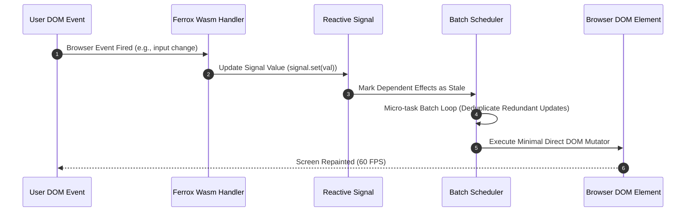

# Core WebAssembly System Architecture

The `ferrox-front` architecture is designed around zero-cost abstractions, fine-grained reactive dependency graphs, single-threaded browser thread execution, WebAssembly linear memory layout, and WebGL rendering acceleration.

---

## 1. What It Is & Architectural Purpose

Web browsers run WebAssembly inside an isolated, sandboxed execution environment. To build complex single-page applications (SPAs) in Wasm without incurring performance degradation, the framework architecture must carefully manage memory allocations, DOM interop boundaries, and asynchronous event callbacks.

`ferrox-front` provides an end-to-end Wasm system architecture. It minimizes JavaScript-to-Wasm bridge context switches by batching DOM updates and delegating heavy calculations to background Web Workers.

```
┌────────────────────────────────────────────────────────────────────────┐
│                        Browser Main Thread                             │
├──────────────────────────────────┬─────────────────────────────────────┤
│  Wasm Linear Memory (Rust App)   │  Browser DOM Engine (web_sys)       │
│  • Signal Dependency Graph       │  • HTML Document Element Tree        │
│  • Effect Scheduler Loop         │  • Event Listener Handlers          │
└────────────────┬─────────────────┴──────────────────┬──────────────────┘
                 │ Fine-Grained Direct Pointer Edits  │
                 ▼                                    ▼
┌────────────────────────────────────────────────────────────────────────┐
│                    WebGL 2.0 Hardware Accelerator                      │
└────────────────────────────────────────────────────────────────────────┘
```

---

## 2. Architectural Layering

1. **Reactive Kernel Layer (`ferrox-front-core`)**: Manages `Signal<T>`, `Memo<T>`, and `Effect<T>` dependency graphs.
2. **Template Expansion Layer (`ferrox-front-templates`)**: Parses JSX and emits Wasm static node cloning routines.
3. **Transport Layer (`ferrox-front-ws`)**: Manages real-time WebSocket channels with binary MsgPack serialization.
4. **Security Layer (`ferrox-front-security`)**: Handles WebCrypto API operations (AES-256-GCM) inside Wasm linear memory.
5. **Visualization Layer (`ferrox-front-charts`)**: Renders high-frequency canvas and WebGL graphics.

---

## 3. How It Works Under the Hood

### Fine-Grained Reactive Execution Flow



---

## 4. Why It Was Designed This Way

| Metric | Traditional JS SPA | Ferrox-Front Wasm Architecture |
| :--- | :--- | :--- |
| **Garbage Collection**| GC pauses cause micro-stuttering during chart animations. | Zero GC pauses. Rust manages stack and arena linear memory. |
| **Type Safety** | Dynamic runtime type checks in JavaScript. | Guaranteed compile-time type safety across Wasm and Rust APIs. |
| **Cryptography** | Slow JS crypto libraries exposed to browser XSS attacks. | Native Wasm WebCrypto executing in isolated linear memory. |

---

## 5. Practical Usage Guide & Extended Code Examples

### 5.1 Application Entry Point & Module Initialization

```rust
use ferrox_front_core::prelude::*;
use ferrox_front_templates::view;
use wasm_bindgen::prelude::*;

#[wasm_bindgen(start)]
pub fn main() {
    // Initialize panic hook for detailed Wasm browser console stack traces
    console_error_panic_hook::set_once();

    mount_to_body(|| view! {
        <main class="app-root">
            <h1>"Welcome to Ferrox Wasm App"</h1>
        </main>
    });
}
```

---

## 6. Anti-Patterns: How NOT to Use It

> [!CAUTION]
> **Anti-Pattern 1: Frequent JS-Wasm String Serialization**
> Avoid serializing large JSON strings back and forth across the JS/Wasm boundary on every frame. Keep data structures inside Wasm memory and pass binary ArrayBuffers when communicating with JS.

---

## 7. Pro-Tips & Best Practices

> [!TIP]
> **Pro-Tip 1: Web Workers for Heavy Computation**
> Offload CPU-heavy algorithms (data compression, image processing) to background Web Workers using `ferrox-front-core` worker channels to keep the main UI thread at 60 FPS.
