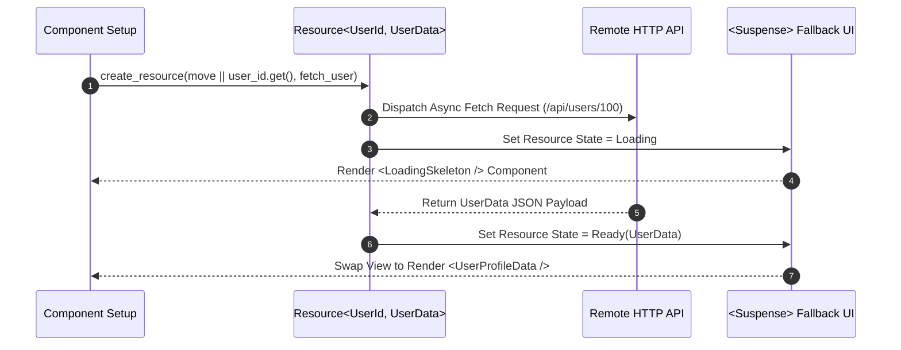

# Core Kernel, Context Providers & Resource Managers

The `ferrox-front-core` crate is the foundation kernel of the Ferrox WebAssembly frontend framework. It manages component context providers (`provide_context`, `use_context`), async resource loaders (`create_resource`), effect batch schedulers, and browser lifecycle event hooks.

---

## 1. What It Is & Architectural Purpose

WebAssembly single-page applications require global context sharing (user identity, theme settings, API clients) across deep component trees without prop-drilling. Furthermore, async data fetching (REST/GraphQL calls) must integrate with reactive signals without race conditions or memory leaks.

`ferrox-front-core` provides context providers and async resource primitives. It establishes a dependency injection tree in Wasm memory and synchronizes async data fetches with reactive UI views.

```
┌────────────────────────────────────────────────────────────────────────┐
│                        ferrox-front-core Kernel                        │
├──────────────────────────────────┬─────────────────────────────────────┤
│  Context Dependency Injection    │  Async Resource Loader              │
│  (provide_context / use_context) │  (create_resource / Suspense)       │
└────────────────┬─────────────────┴──────────────────┬──────────────────┘
                 │ State Synchronization
                 ▼
┌────────────────────────────────────────────────────────────────────────┐
│                        Component Tree Hierarchy                        │
└────────────────────────────────────────────────────────────────────────┘
```

---

## 2. What It Does & Key Capabilities

- **`provide_context<T>()` & `use_context<T>()`**: Type-safe context injection across component sub-trees without manual prop passing.
- **`create_resource()`**: Asynchronous data loader that automatically re-fetches when source signals mutate and manages loading states.
- **`<Suspense>` & `<Transition>` Components**: Declarative fallback components that render loading skeletons until async resources settle.
- **Global Microtask Scheduler**: Schedules and deduplicates reactive effect updates using browser microtask queues (`queueMicrotask`).

---

## 3. How It Works Under the Hood

### Async Resource Loader & Suspense Sequence



---

## 4. Why It Was Designed This Way

| Feature | Prop Drilling & Manual Fetches | Ferrox Core Kernel |
| :--- | :--- | :--- |
| **Data Propagation** | Passing global theme/auth props through 10 component layers. | Single `use_context::<AuthStore>()` call anywhere in tree. |
| **Race Conditions** | Fast user typing causes out-of-order async fetch responses. | `create_resource` automatically cancels stale in-flight requests. |
| **Loading States** | Manual `if is_loading { ... }` checks scattered everywhere. | Declarative `<Suspense fallback=...> ` handles loading state globally. |

---

## 5. Practical Usage Guide & Extended Code Examples

### 5.1 Context Provider & Dependency Injection

```rust
use ferrox_front_core::prelude::*;
use ferrox_front_templates::view;

#[derive(Clone)]
pub struct UserSession {
    pub user_id: String,
    pub token: String,
}

#[component]
pub fn AppRoot() -> impl IntoView {
    // Provide user session context to all descendant components
    provide_context(UserSession {
        user_id: "usr_777".to_string(),
        token: "bearer_xyz_123".to_string(),
    });

    view! {
        <main class="app">
            <UserProfileHeader />
        </main>
    }
}

#[component]
pub fn UserProfileHeader() -> impl IntoView {
    // Retrieve injected session context anywhere in tree
    let session = use_context::<UserSession>().expect("UserSession context missing!");

    view! {
        <header>
            <span>"Logged in as: " {session.user_id}</span>
        </header>
    }
}
```

---

## 6. Anti-Patterns: How NOT to Use It

> [!CAUTION]
> **Anti-Pattern 1: Context Overuse for Local Component State**
> Avoid placing purely local component state (like dropdown open/closed flags) into global context. Keep context restricted to shared global application state.

---

## 7. Pro-Tips & Best Practices

> [!TIP]
> **Pro-Tip 1: Resource Refetching**
> Trigger manual refetching of async resources using `resource.refetch()` when a user clicks a refresh button or completes an edit operation.
