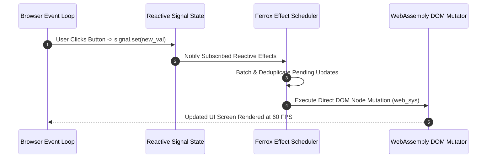

# Introduction & Ferrox-Front Architecture

Welcome to **Ferrox-Front**, the high-performance WebAssembly (Wasm) frontend framework written in pure Rust. It combines fine-grained reactive signals, compile-time JSX HTML templates, zero-trust cryptographic security, real-time WebSocket state synchronization, and GPU-accelerated WebGL charts into a unified application suite.

---

## 1. What It Is & Architectural Purpose

Modern web applications require rendering complex, real-time user interfaces with high responsiveness. However, JavaScript frontend frameworks (React, Vue, Angular) struggle with heavy client-side computations (real-time telemetry charts, client-side encryption, large data grid rendering) due to single-threaded event-loop bottlenecks and garbage collection pauses.

**Ferrox-Front** leverages Rust and WebAssembly to eliminate runtime garbage collection entirely. It delivers native 60 FPS rendering performance, compile-time type safety, and fine-grained reactive state updates without Virtual DOM overhead.

```
┌────────────────────────────────────────────────────────────────────────────────────────┐
│                                YOUR FERROX-FRONT WASM APP                              │
├────────────────────────────────────────────────────────────────────────────────────────┤
│  Fine-Grained Signals  │  Compile-Time JSX  │  Wasm Router  │  WebGL Charts  │  WebSockets │
├────────────────────────┴────────────────────┴───────────────┴────────────────┴──────────┤
│                                FERROX-FRONT CORE CRATES                                │
├────────────────────────────────────────────────────────────────────────────────────────┤
│  Rust / WebAssembly  │  web-sys / js-sys Binding  │  Browser Web Cryptography API      │
└────────────────────────────────────────────────────────────────────────────────────────┘
```

---

## 2. Crate Architecture Breakdown

| Crate | Category & Purpose | Key Capabilities |
| :--- | :--- | :--- |
| **`ferrox-front-core`** | Framework Foundation | Signal runtime, effect scheduler, resource context primitives. |
| **`ferrox-front-templates`**| HTML / JSX Engine | Compile-time `view!` JSX macro, static node cloning, SSR. |
| **`ferrox-front-macro`** | Procedural Macros | Component procedural macros (`#[component]`), memo derives. |
| **`ferrox-front-router`**| Client Navigation | Declarative Wasm client-side routing & route guard matching. |
| **`ferrox-front-ui`** | Component Library | Accessible UI primitives (buttons, modals, data tables). |
| **`ferrox-front-charts`**| Data Visualization | GPU-accelerated WebGL charts (candlestick, line, bar). |
| **`ferrox-front-ws`** | Real-Time Transport | Reconnecting WebSocket manager with binary MsgPack support. |
| **`ferrox-front-security`**| Zero-Trust Wasm | WebCrypto API integration, AES-256-GCM, XSS sanitizers. |

---

## 3. Core Architectural Philosophy

### 1. Zero-Virtual DOM Overhead
Unlike VDOM frameworks that diff full object trees on state mutations, Ferrox-Front binds signals directly to individual DOM node pointers.

### 2. Native Memory Performance
Rust's affine type system and ownership model guarantee memory safety and zero garbage collection pauses during intensive rendering.

### 3. End-to-End Type Integrity
Share identical Rust data models (structs, enums, validation rules) across your backend Ferrox microservices and WebAssembly frontend app.

---

## 4. Execution Sequence Flow



---

## 5. Next Steps

- Proceed to the [Quickstart Guide](quickstart.md) to build your first Rust Wasm frontend app.
- Explore individual crate guides in the sidebar documentation sections.
