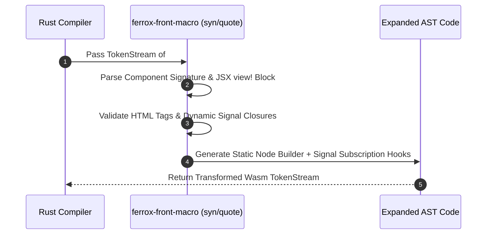

# Procedural Macros, Component Annotations & Code Generation

The `ferrox-front-macro` crate provides Rust procedural macros (`#[component]`, `view!`, `derive(Store)`) that transform declarative UI components and reactive state structs into optimized WebAssembly execution code.

---

## 1. What It Is & Architectural Purpose

Writing WebAssembly DOM code in raw Rust using `web_sys` requires verbose boilerplate: creating element nodes, attaching event listeners via `Closure::wrap`, casting `Element` pointers, and manually managing signal subscription lifecycles.

`ferrox-front-macro` abstracts WebAssembly DOM complexity through procedural compile-time expansion. It allows developers to write clean, HTML-like component code that compiles into ultra-low-level Wasm DOM calls.

```
┌────────────────────────────────────────────────────────────────────────┐
│                        Rust Source Code                                │
├────────────────────────────────────────────────────────────────────────┤
│  #[component]                                                          │
│  pub fn Counter(initial: i32) -> impl IntoView { ... }                 │
└──────────────────────────────────┬─────────────────────────────────────┘
                                   │ Proc-Macro Compile-Time Expansion
                                   ▼
┌────────────────────────────────────────────────────────────────────────┐
│                       Generated Wasm Code                              │
├────────────────────────────────────────────────────────────────────────┤
│  • Signal Subscription Graph Wiring                                    │
│  • Static Node Memory Pre-allocation                                   │
│  • Fine-Grained Listener Registration via web_sys                      │
└────────────────────────────────────────────────────────────────────────┘
```

---

## 2. What It Does & Key Capabilities

- **`#[component]` Macro**: Annotates Rust functions as reusable UI components, automatically converting function parameters into strongly typed component props.
- **`view!` Macro**: Parses JSX-style HTML syntax, attributes, dynamic signal closures, and event handlers into static DOM node clones.
- **`derive(Store)` Macro**: Automatically derives reactive store traits for nested Rust data structs, turning struct fields into reactive signals.
- **Compile-Time Prop Validation**: Catches missing or incorrectly typed component properties at Rust compile time.

---

## 3. How It Works Under the Hood

### Macro Parsing & Expansion Sequence



---

## 4. Why It Was Designed This Way

| Feature | Raw web_sys DOM Calls | Ferrox Proc-Macros |
| :--- | :--- | :--- |
| **Boilerplate** | 50+ lines of DOM element creation and memory management per button. | Single line HTML tag in `view!` macro. |
| **Type Safety** | Loose JavaScript strings for element IDs and event names. | Compiler validates event types and component prop schemas. |
| **Performance** | Dynamic string parsing at runtime. | Zero-overhead compile-time code generation. |

---

## 5. Practical Usage Guide & Extended Code Examples

### 5.1 Writing Custom Components with `#[component]`

```rust
use ferrox_front_core::prelude::*;
use ferrox_front_macro::component;
use ferrox_front_templates::view;

#[component]
pub fn MetricCard(
    title: String,
    value: Signal<f64>,
    #[prop(optional)] unit: Option<String>,
) -> impl IntoView {
    let formatted_value = create_memo(move |_| {
        format!("{:.2}", value.get())
    });

    view! {
        <div class="metric-card">
            <span class="metric-title">{title}</span>
            <div class="metric-value-wrapper">
                <span class="metric-value">{move || formatted_value.get()}</span>
                {unit.map(|u| view! { <span class="metric-unit">{u}</span> })}
            </div>
        </div>
    }
}
```

---

## 6. Anti-Patterns: How NOT to Use It

> [!CAUTION]
> **Anti-Pattern 1: Mutating Props inside Components**
> Component parameters passed into `#[component]` functions should be treated as immutable. Mutate state exclusively through `Signal<T>` setters.

---

## 7. Pro-Tips & Best Practices

> [!TIP]
> **Pro-Tip 1: `#[prop(optional)]` Annotations**
> Use `#[prop(optional)]` or `#[prop(default = 10)]` on component parameters to allow optional props without requiring callers to pass `Some(...)`.
