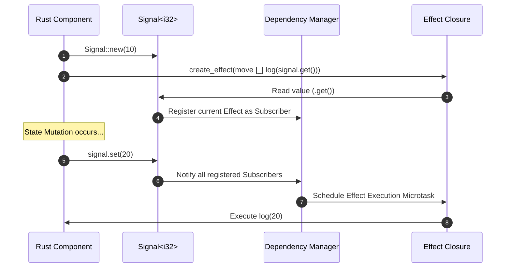

# Fine-Grained Reactive Primitives (Signals, Memos & Effects)

The `ferrox-front-core` reactivity engine provides fine-grained reactive state management in WebAssembly. Built on push-pull signal graphs, it exposes `Signal<T>`, `ReadSignal<T>`, `WriteSignal<T>`, `Memo<T>`, and `Effect<T>` primitives without relying on Virtual DOM diffing.

---

## 1. What It Is & Architectural Purpose

Coarse-grained state management frameworks (like React) re-evaluate entire component functions whenever state changes, necessitating virtual DOM tree diffing to find modified nodes.

`ferrox-front-core` implements fine-grained reactivity. Components execute **only once** during initial setup to build the UI graph. When a `Signal<T>` updates, only the specific closures or DOM text nodes subscribed to that exact signal re-evaluate.

```
┌────────────────────────────────────────────────────────────────────────┐
│                      Fine-Grained Signal Graph                         │
├────────────────────────────────────────────────────────────────────────┤
│  [ Signal: count (0) ] ─────────> [ Memo: double_count (0) ]           │
│           │                                    │                       │
│           ▼                                    ▼                       │
│  [ DOM TextNode #1 ]                  [ DOM TextNode #2 ]              │
└────────────────────────────────────────────────────────────────────────┘
```

---

## 2. What It Does & Key Capabilities

- **`Signal<T>`**: Primary reactive read-write container with lock-free atomic dependency tracking.
- **`ReadSignal<T>` & `WriteSignal<T>`**: Separated read/write interfaces to enforce unidirectional data flow.
- **`Memo<T>`**: Derived reactive value that lazily recomputes and caches results only when source signals change.
- **`Effect<T>`**: Side-effect subscriber that automatically re-runs whenever read signals within its closure update.

---

## 3. How It Works Under the Hood

### Reactive Signal Dependency Graph



---

## 4. Why It Was Designed This Way

| Feature | Virtual DOM Re-rendering | Ferrox Fine-Grained Signals |
| :--- | :--- | :--- |
| **Execution Cost** | Entire component function re-runs on state change. | Component function runs ONCE. Only subscriber closures re-run. |
| **Memory Footprint**| High allocation of transient virtual DOM objects. | Zero transient objects. Permanent memory pointers. |
| **Scalability** | Slow UI performance when managing 10,000+ state fields. | Constant O(1) update complexity per subscribed node. |

---

## 5. Practical Usage Guide & Extended Code Examples

### 5.1 Reactive State Management

```rust
use ferrox_front_core::prelude::*;

pub fn reactive_counter_demo() {
    let (count, set_count) = create_signal(0);

    // Derived memoized computation
    let is_even = create_memo(move |_| count.get() % 2 == 0);

    // Side effect subscriber
    create_effect(move |_| {
        println!("Count changed: {}, Is Even: {}", count.get(), is_even.get());
    });

    // Mutate state
    set_count.set(1); // Prints: Count changed: 1, Is Even: false
    set_count.set(2); // Prints: Count changed: 2, Is Even: true
}
```

---

## 6. Anti-Patterns: How NOT to Use It

> [!CAUTION]
> **Anti-Pattern 1: Mutating Signals inside Effects**
> Avoid calling `signal_a.set(...)` inside an effect that reads `signal_a.get()`. This creates infinite reactive loop cycles that overflow the Wasm stack.

---

## 7. Pro-Tips & Best Practices

> [!TIP]
> **Pro-Tip 1: `batch()` Updates**
> Wrap multiple signal mutations in `batch(|| { sig1.set(x); sig2.set(y); })` to trigger dependent effects only once per batch.
