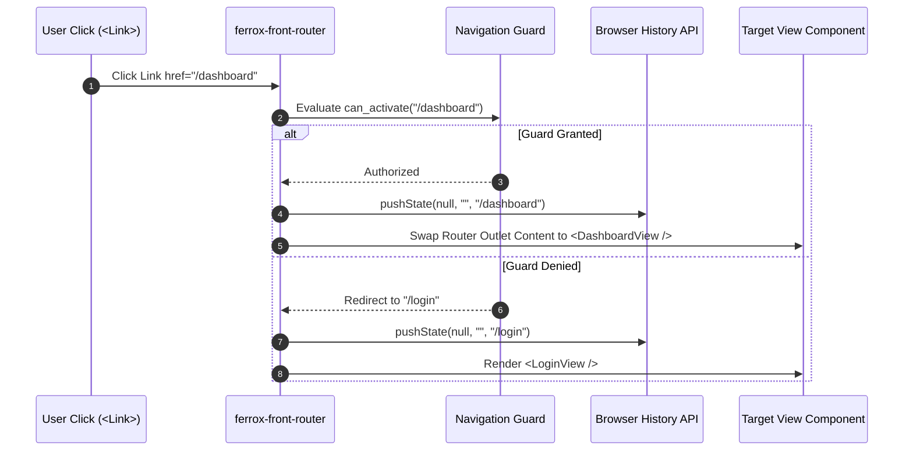

# Client-Side Router, Route Guards & Lazy Loading

The `ferrox-front-router` crate delivers client-side SPA navigation for WebAssembly apps. It features HTML5 History API integration, route path parameter matching, nested layout outlets, route protection guards, and code-split WebAssembly module lazy loading.

---

## 1. What It Is & Architectural Purpose

Single-page WebAssembly applications require seamless page transitions without full browser reloads. Client-side navigation must handle dynamic URL paths (`/users/:id`), query string parsing, authenticated layout switching, and route protection guards in pure Rust.

`ferrox-front-router` provides a declarative client-side router. It hooks into the browser HTML5 `History.pushState` API and updates reactive route signals to render target views instantly.

```
┌────────────────────────────────────────────────────────────────────────┐
│                         ferrox-front-router                            │
├──────────────────────────────────┬─────────────────────────────────────┤
│  HTML5 History API Listener      │  Route Guard Evaluator              │
│  (pushState / popstate)          │  (AuthGuard / RoleGuard)            │
└────────────────┬─────────────────┴──────────────────┬──────────────────┘
                 │ Path Matcher (/users/:id)
                 ▼
┌────────────────────────────────────────────────────────────────────────┐
│                        Dynamic View Router Outlet                      │
└────────────────────────────────────────────────────────────────────────┘
```

---

## 2. What It Does & Key Capabilities

- **Declarative Route Definition**: Provides `<Router>`, `<Routes>`, `<Route>`, and `<Outlet>` components.
- **Dynamic Path Parameter Extraction**: Extracts named route parameters (`/orders/:order_id`) into typed Rust variables.
- **Route Authorization Guards**: Blocks unauthorized client navigation via custom `Guard` traits before mounting views.
- **Nested Layout Outlets**: Supports nested layout hierarchies (e.g., sidebar layout wrapping nested dashboard sub-pages).

---

## 3. How It Works Under the Hood

### Client Navigation Sequence



---

## 4. Why It Was Designed This Way

| Feature | Server-Side Full Page Reloads | Ferrox Client Router |
| :--- | :--- | :--- |
| **Transition Speed** | High latency. Full HTML/Wasm re-download on every click. | Instant 0ms page transitions. Re-renders only outlet views. |
| **State Retention** | In-memory Wasm state lost on page navigation. | Reactive state preserved in memory across client routes. |
| **Security** | Unprotected frontend views flicker before JS redirects. | Route guards prevent unauthenticated view mounts entirely. |

---

## 5. Practical Usage Guide & Extended Code Examples

### 5.1 Defining Application Routes

```rust
use ferrox_front_core::prelude::*;
use ferrox_front_router::*;
use ferrox_front_templates::view;

#[component]
pub fn AppRouter() -> impl IntoView {
    view! {
        <Router>
            <nav class="main-nav">
                <A href="/">"Home"</A>
                <A href="/dashboard">"Dashboard"</A>
                <A href="/settings">"Settings"</A>
            </nav>

            <Routes>
                <Route path="/" view=HomeView />
                <Route path="/dashboard" view=DashboardView guard=AuthGuard />
                <Route path="/users/:id" view=UserProfileView />
                <Route path="/*any" view=NotFoundView />
            </Routes>
        </Router>
    }
}
```

---

## 6. Anti-Patterns: How NOT to Use It

> [!CAUTION]
> **Anti-Pattern 1: Standard `<a>` Anchor Tags**
> Avoid using raw HTML `<a href="/path">` tags for internal app navigation. Raw anchors trigger full browser page reloads. Always use `<A href="/path">` or `use_navigate()`.

---

## 7. Pro-Tips & Best Practices

> [!TIP]
> **Pro-Tip 1: Programmatic Navigation**
> Use the `use_navigate()` hook to trigger client-side navigation inside event callbacks:
> `let navigate = use_navigate(); navigate("/login", NavigateOptions::default());`
