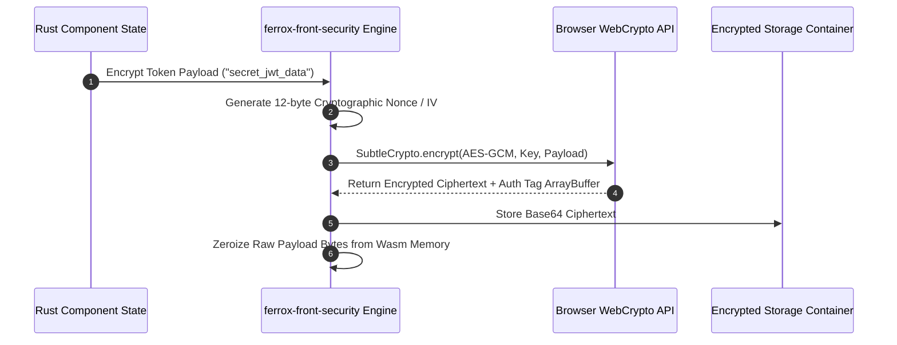

# Zero-Trust Wasm Security, WebCrypto & XSS Sanitization

The `ferrox-front-security` crate delivers zero-trust security for Rust WebAssembly applications. It features browser WebCrypto API bindings (AES-256-GCM, RSA-OAEP, ECDSA), zero-copy linear memory wiping (`Zeroize`), secure storage adapters, and HTML XSS sanitizers.

---

## 1. What It Is & Architectural Purpose

Standard JavaScript web applications store sensitive tokens (JWTs, encryption keys, PII) in plain text inside JavaScript objects or localStorage, leaving them exposed to cross-site scripting (XSS) extraction attacks and browser extension inspection.

`ferrox-front-security` implements zero-trust security inside WebAssembly linear memory. It encrypts sensitive payloads in Wasm memory using AES-256-GCM via the browser's native WebCrypto subsystem, automatically wiping sensitive byte arrays from linear memory when dropped.

```
┌────────────────────────────────────────────────────────────────────────┐
│                    Ferrox Zero-Trust Wasm Security                     │
├──────────────────────────────────┬─────────────────────────────────────┤
│  Wasm Linear Memory Encryption   │  WebCrypto Subsystem Integration    │
│  • Automatic Zeroize Memory Wipe │  • AES-256-GCM Authenticated Cipher│
│  • Memory Protection Boundaries  │  • SubtleCrypto Hardware Acceleration│
└────────────────┬─────────────────┴──────────────────┬──────────────────┘
                 │ Secure Key Storage
                 ▼
┌────────────────────────────────────────────────────────────────────────┐
│                        Encrypted Browser Storage                       │
└────────────────────────────────────────────────────────────────────────┘
```

---

## 2. What It Does & Key Capabilities

- **AES-256-GCM Cryptography**: Authenticated symmetric encryption and decryption using WebCrypto hardware acceleration.
- **`Zeroize` Memory Hardening**: Wipes sensitive cryptographic keys and token byte slices from Wasm linear memory on `Drop`.
- **HTML XSS Sanitization**: Strips dangerous script tags, `javascript:` URIs, and un-sanitized HTML attributes prior to DOM rendering.
- **Secure Encrypted Storage**: Encrypts sensitive localStorage keys with ephemeral Wasm master keys.

---

## 3. How It Works Under the Hood

### WebCrypto AES-256-GCM Encryption Sequence



---

## 4. Why It Was Designed This Way

| Feature | Standard JavaScript Security | Ferrox Wasm Security |
| :--- | :--- | :--- |
| **Key Exposure** | JS keys visible in browser dev console memory inspection. | Keys kept inside isolated Wasm linear memory. |
| **XSS Immunity** | Malicious scripts can steal `window.localStorage` tokens. | Encrypted storage requires Wasm master key to decipher. |
| **Memory Cleanup**| GC leaves sensitive string buffers in RAM indefinitely. | `Zeroize` overwrites sensitive memory with `0x00` on drop. |

---

## 5. Practical Usage Guide & Extended Code Examples

### 5.1 AES-256-GCM Encryption and Decryption

```rust
use ferrox_front_security::{CryptoEngine, SecureBuffer};

pub async fn encrypt_sensitive_token(token: &str) -> Result<String, String> {
    let crypto = CryptoEngine::new()?;

    // Generate ephemeral AES-256-GCM key
    let key = crypto.generate_aes_key().await?;

    // Encrypt string payload into secure buffer
    let encrypted_data = crypto.encrypt_aes_gcm(&key, token.as_bytes()).await?;

    // Decrypt payload back
    let decrypted_bytes = crypto.decrypt_aes_gcm(&key, &encrypted_data).await?;
    let decrypted_string = String::from_utf8(decrypted_bytes).map_err(|e| e.to_string())?;

    assert_eq!(token, decrypted_string);
    Ok(encrypted_data.to_base64())
}
```

---

## 6. Anti-Patterns: How NOT to Use It

> [!CAUTION]
> **Anti-Pattern 1: Storing Plaintext Passwords in Long-Lived Strings**
> Avoid storing raw user passwords or API tokens in long-lived Rust `String` structs without wrapping them in `SecureBuffer` or `Zeroize` wrappers. Plain strings persist in Wasm memory until garbage collection.

---

## 7. Pro-Tips & Best Practices

> [!TIP]
> **Pro-Tip 1: Content Security Policy (CSP)**
> Always pair `ferrox-front-security` with a strict HTTP Content Security Policy (`script-src 'wasm-unsafe-eval' 'self'`) to prevent unauthorized external script injections.
