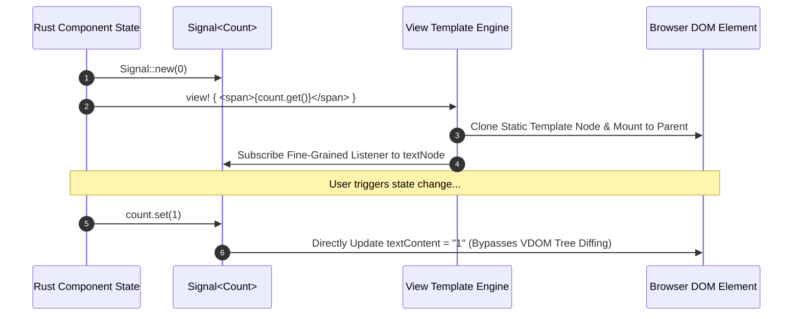

# Virtual DOM Templates, JSX Engine & HTML Macros

The `ferrox-front-templates` crate delivers zero-allocation HTML templating, WebAssembly compile-time JSX expansion, reactive DOM element patching, and SSR (Server-Side Rendering) string interpolation for Rust web applications.

---

## 1. What It Is & Architectural Purpose

Traditional frontend web frameworks in Rust (like Yew or Seed) rely heavily on macro-based virtual DOM trees that generate thousands of temporary heap allocations on every state update. In high-frequency rendering scenarios (real-time financial charts, dashboard widgets, streaming logs), continuous DOM diffing causes garbage collection frame drops.

`ferrox-front-templates` provides a static-tree JSX template compiler (`view! { ... }`). It analyzes static DOM nodes at compile time and emits direct DOM mutation instructions for reactive dynamic bindings, achieving near-native WebAssembly performance.

```
┌────────────────────────────────────────────────────────────────────────┐
│                        Rust Compile Time (proc_macro)                  │
├────────────────────────────────────────────────────────────────────────┤
│  view! { <div class="card"><h1>{title}</h1></div> }                     │
│    │                                                                   │
│    ├── Static DOM Nodes  -> Emitted as single WebAssembly Element      │
│    └── Dynamic Expressions -> Bound directly to Signal listeners       │
└──────────────────────────────────┬─────────────────────────────────────┘
                                   │ Direct Wasm DOM Manipulation
                                   ▼
┌────────────────────────────────────────────────────────────────────────┐
│                        Browser Document Object Model                   │
└────────────────────────────────────────────────────────────────────────┘
```

---

## 2. What It Does & Key Capabilities

- **Compile-Time Template Parsing**: Validates HTML syntax and attributes during Rust compilation.
- **Direct Dynamic Binding**: Binds Rust signals (`Signal<T>`) directly to DOM node text and attributes without re-rendering parent elements.
- **Server-Side Rendering (SSR)**: Compiles identical `view!` macro templates into fast HTML string writers for hydration.
- **Zero-Allocation Node Cache**: Reuses DOM node templates via `web_sys::Node::clone_node()`.

---

## 3. How It Works Under the Hood

### Reactive Template Patching Sequence



---

## 4. Why It Was Designed This Way

| Feature | Virtual DOM Tree Diffing | Ferrox Fine-Grained Templates |
| :--- | :--- | :--- |
| **Allocation Cost** | Re-allocates virtual DOM tree nodes on every render frame. | Zero allocations on update. Direct DOM pointer mutation. |
| **Compiler Safety** | Un-validated HTML string templates fail at runtime. | Invalid HTML tags or unclosed elements break Rust build instantly. |
| **SSR Hydration** | Requires double-rendering components on client mount. | Seamless HTML hydration using pre-parsed element IDs. |

---

## 5. Practical Usage Guide & Extended Code Examples

### 5.1 Declarative Component Templating

```rust
use ferrox_front_core::prelude::*;
use ferrox_front_templates::view;

#[component]
pub fn UserCard(name: String, role: String, active: Signal<bool>) -> impl IntoView {
    view! {
        <div class="user-card-container">
            <h3 class="user-name">{name}</h3>
            <span class="user-role">{role}</span>
            <button 
                class={move || if active.get() { "btn-active" } else { "btn-disabled" }}
                on:click=move |_| active.set(!active.get())
            >
                {move || if active.get() { "Deactivate User" } else { "Activate User" }}
            </button>
        </div>
    }
}
```

---

## 6. Anti-Patterns: How NOT to Use It

> [!CAUTION]
> **Anti-Pattern 1: Passing Un-memoized Closure Signals**
> Avoid performing expensive matrix math inside view interpolation closures (`{move || heavy_calculation()}`). Always wrap complex dynamic derivations in `create_memo()`.

---

## 7. Pro-Tips & Best Practices

> [!TIP]
> **Pro-Tip 1: Keyed List Rendering**
> Use `<For>` components with explicit key functions when rendering dynamic lists to preserve DOM element identity across list re-ordering.
