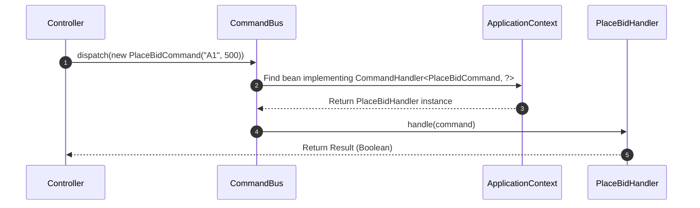

# Command & Query Bus Segregation

The `ferrox-java-cqrs` module enforcing strict **Command Query Responsibility Segregation (CQRS)** across the entire JVM ecosystem.

---

## 1. What It Is & Architectural Purpose

Standard Java applications often suffer from "God Services"—massive `@Service` classes containing hundreds of methods mixing reads, writes, transactions, and domain logic. 

**Ferrox CQRS** splits this monolith into discrete, atomic objects:
- **Commands:** Intents to change state (Writes).
- **Queries:** Requests for data (Reads).

The `CommandBus` and `QueryBus` act as mediators. Controllers never inject Services directly. Instead, they dispatch a Command/Query to the Bus, which dynamically routes it to the correct handler.

---

## 2. What It Does & Key Capabilities

- **Zero-Coupling:** Controllers are decoupled from business logic.
- **Dynamic Dispatch:** The Bus utilizes the Spring `ApplicationContext` to reflectively discover and route payloads to the correct `CommandHandler` or `QueryHandler`.
- **Testability:** Mocking becomes trivial. You only mock the Bus, not 15 different Service dependencies.

---

## 3. How It Works Under the Hood



---

## 4. Why It Was Designed This Way

| Feature | N-Tier Architecture (Service Layer) | Ferrox CQRS |
| :--- | :--- | :--- |
| **Dependency Graph**| Controllers inject 10+ services. Circular dependencies common. | Controllers inject exactly 1 thing: The Bus. |
| **Refactoring** | Changing a service breaks multiple controllers. | Handlers are atomic. You can delete or rewrite a handler with zero side effects. |

---

## 5. Practical Usage Guide

### Defining a Command and Handler

```java
// 1. Define the Command (Java 14+ Record)
public record PlaceBidCommand(String auctionId, double amount) implements Command<Boolean> {}

// 2. Define the Handler
@Service
public class PlaceBidHandler implements CommandHandler<PlaceBidCommand, Boolean> {
    @Override
    public Boolean handle(PlaceBidCommand command) {
        // Business logic here
        return true;
    }
}
```

### Dispatching from Controller

```java
@RestController
public class BidController {
    
    private final CommandBus commandBus;
    
    // Spring injects the bus
    public BidController(CommandBus commandBus) {
        this.commandBus = commandBus;
    }
    
    @PostMapping("/bid")
    public Boolean bid() {
        return commandBus.dispatch(new PlaceBidCommand("A1", 500.0));
    }
}
```
