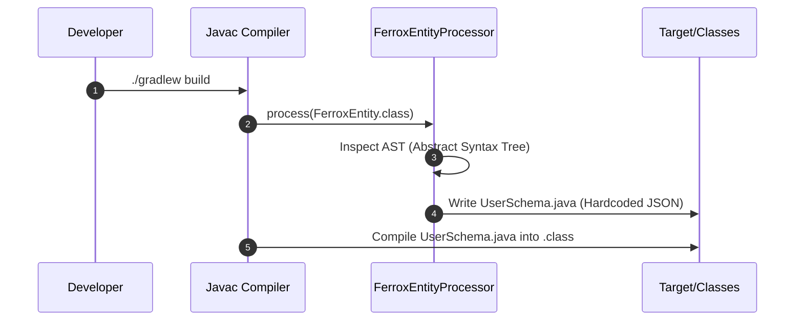

# Compile-Time Metaprogramming (APT)

The `ferrox-java-crud-gen` module brings advanced metaprogramming to the JVM ecosystem. It replaces slow runtime reflection with **Java Annotation Processors (APT)** to generate code at compile time, achieving exact feature parity with Rust's procedural macros (e.g., `#[derive(FerroxEntity)]`).

---

## 1. What It Is & Architectural Purpose

Modern frameworks (like Spring Data REST or Hibernate) heavily rely on runtime Reflection. When the application starts, it scans classes, reads annotations, and dynamically builds JSON schemas or SQL queries. This causes massive memory spikes and slow startup times (Cold Starts).

**Ferrox-Java** eliminates this entirely. By hooking directly into the `javac` compiler, it reads the `@FerroxEntity` annotations *during the build phase* and outputs raw `.java` source code containing the pre-computed JSON schemas.

---

## 2. What It Does & Key Capabilities

- **Zero-Overhead Schema Generation:** Generates `*Schema.java` classes containing hardcoded JSON strings.
- **Admin UI Integration:** The generated schemas include grid configurations (`adminGrid = true`) and role-based access control metadata (`roleRead`, `roleWrite`), ready to be consumed by the frontend.
- **Instant Cold Starts:** Because no reflection happens at startup, the application boots instantly, making it perfect for AWS Lambda or Kubernetes Serverless scaling.

---

## 3. How It Works Under the Hood



---

## 4. Why It Was Designed This Way

| Feature | Standard Reflection (Spring) | Ferrox APT Metaprogramming |
| :--- | :--- | :--- |
| **Startup Time** | Slow. Must scan classpath at boot. | Instant. Pre-computed at compile time. |
| **Memory Footprint**| High. Retains reflection metadata in Heap. | Zero. Uses standard Java String constants. |
| **Rust Parity** | N/A | Exact match to Rust's `#[derive]` macros. |

---

## 5. Practical Usage Guide

### Annotating your Domain Entity

Simply decorate your class with `@FerroxEntity` and your fields with `@FerroxField`.

```java
import dev.ferrox.crudgen.annotation.FerroxEntity;
import dev.ferrox.crudgen.annotation.FerroxField;

@FerroxEntity(table = "users", roleRead = "USER", roleWrite = "ADMIN")
public class User {

    @FerroxField(isPrimaryKey = true)
    private String id;
    
    @FerroxField(isSearchable = true)
    private String email;
}
```

### Accessing the Generated Code

During compilation, the processor creates `UserSchema.java`. You can access it directly in your code without any reflection!

```java
String schemaJson = UserSchema.getFerroxSchema();
System.out.println(schemaJson); 
// Outputs the highly optimized JSON schema for the UI
```
