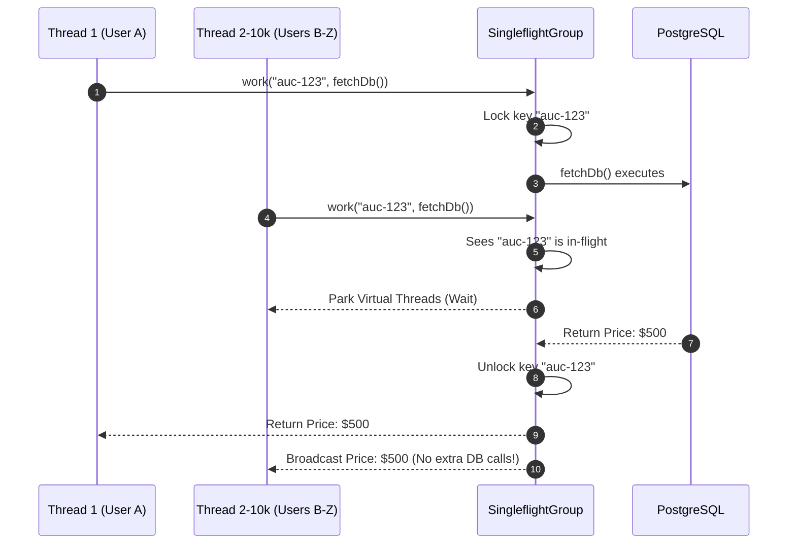

# Singleflight Cache Stampede Prevention

The `ferrox-java-data` module implements the **Singleflight** pattern natively in Java. It completely eliminates Cache Stampede (Dogpiling) by collapsing thousands of concurrent duplicate operations into a single execution.

---

## 1. What It Is & Architectural Purpose

In highly concurrent applications (like High-Frequency Trading or real-time auctions), a cache miss or a hot database key can cause a **Cache Stampede**. If 10,000 users request the current price of "Auction 123" at the exact same millisecond, and the value isn't cached (or the cache expired), all 10,000 threads will independently query the database.

The database connection pool will exhaust immediately, the CPU will spike, and the system will crash.

**Singleflight** acts as a traffic controller. When multiple threads ask for the same key simultaneously, it lets the *first* thread execute the DB query. The other 9,999 threads are suspended. When the first thread finishes, it broadcasts the result to all 10,000 threads simultaneously.

---

## 2. What It Does & Key Capabilities

- **Database Protection:** Guarantees that a function for a specific key runs only **once**, no matter how many threads call it concurrently.
- **Virtual Thread Native:** Leverages Java `CompletableFuture` and Project Loom (Virtual Threads) to park waiting threads with virtually zero memory overhead.

---

## 3. How It Works Under the Hood



---

## 4. Why It Was Designed This Way

| Feature | Standard Spring Cache (`@Cacheable`) | Ferrox Singleflight |
| :--- | :--- | :--- |
| **Concurrent Miss Behavior**| Multiple threads bypassing the cache hit the DB simultaneously. | Threads are parked; only 1 thread hits the DB. |
| **Stale Data** | Subject to race conditions during cache eviction. | Guarantees synchronous data retrieval per key group. |

---

## 5. Practical Usage Guide

```java
import dev.ferrox.data.SingleflightGroup;
import org.springframework.stereotype.Service;

@Service
public class AuctionService {
    
    private final SingleflightGroup singleflight;
    
    public Double getLivePrice(String auctionId) {
        // If 1000 users call this at the exact same time, 
        // slowDbQuery() is executed exactly 1 time.
        return singleflight.work("price_" + auctionId, () -> {
            return slowDbQuery(auctionId);
        });
    }
}
```

---

## 6. Anti-Patterns: How NOT to Use It

> [!CAUTION]
> **Anti-Pattern 1: Side Effects inside Singleflight**
> Never place data mutation (e.g., `UPDATE` or `INSERT`) inside the `singleflight.work()` callable. Since it suppresses duplicate executions, mutations from the suppressed threads will be lost. **Only use it for idempotent reads (Queries).**

---

## 7. Pro-Tips & Best Practices

> [!TIP]
> **Pro-Tip 1: Combine with Redis**
> For the ultimate architecture, combine Singleflight with a Redis cache. Wrap your `redisTemplate.get()` inside `singleflight.work()`. This prevents a network storm to Redis!
