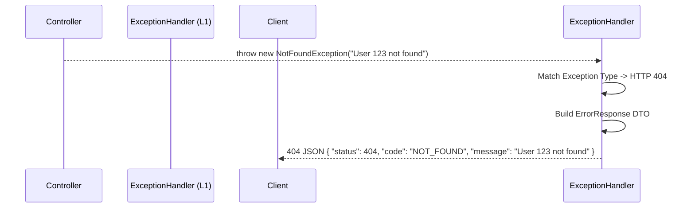

# Standardized Error Taxonomy

The `ferrox-java-core` and `ferrox-java-web` modules collaborate to provide a unified Error Taxonomy. This mirrors the behavior of `@node-yalc/errors`, ensuring that frontend clients receive exactly the same JSON error structures regardless of whether the backend is Node.js, Rust, or Java.

---

## 1. What It Is & Architectural Purpose

When an exception occurs in standard Spring Boot, it typically returns a gigantic StackTrace in HTML format (the "Whitelabel Error Page"), or an inconsistent JSON structure containing sensitive internal class names.

**Ferrox Error Taxonomy** intercepts *all* exceptions at Layer 1 of the Onion Pipeline (`GlobalExceptionHandler`). It classifies them, strips sensitive internal data, and formats them into a strict `ErrorResponse` contract.

---

## 2. What It Does & Key Capabilities

- **Unified Base Exceptions:** Exposes `AppException`, `NotFoundException`, `UnauthorizedException`.
- **Automatic Translation:** Translates Spring's internal exceptions (e.g., `MethodArgumentNotValidException`, `NoHandlerFoundException`) into our standard taxonomy.
- **Security-First:** Never leaks StackTraces to the client, but guarantees they are logged internally by `FerroxLogger` for debugging.

---

## 3. How It Works Under the Hood



---

## 4. Practical Usage Guide

### Throwing standard errors in your Handlers

```java
import dev.ferrox.core.exception.NotFoundException;
import dev.ferrox.core.exception.BusinessRuleException;

@Service
public class DeleteUserHandler implements CommandHandler<DeleteUserCommand, Void> {

    @Override
    public Void handle(DeleteUserCommand cmd) {
        if (!database.exists(cmd.userId())) {
            throw new NotFoundException("User does not exist");
        }
        
        if (database.isSuperAdmin(cmd.userId())) {
            throw new BusinessRuleException("Cannot delete a superadmin");
        }
        
        return null;
    }
}
```

### The JSON Response (What the Frontend sees)

Regardless of the exception type, the frontend will *always* receive this exact shape:

```json
{
  "timestamp": "2026-09-19T21:45:00Z",
  "status": 400,
  "code": "BUSINESS_RULE_VIOLATION",
  "message": "Cannot delete a superadmin",
  "correlationId": "8f8b3c-1293a"
}
```
*Note that the `correlationId` matches the HTTP header and the internal JSON log, allowing immediate cross-referencing.*
