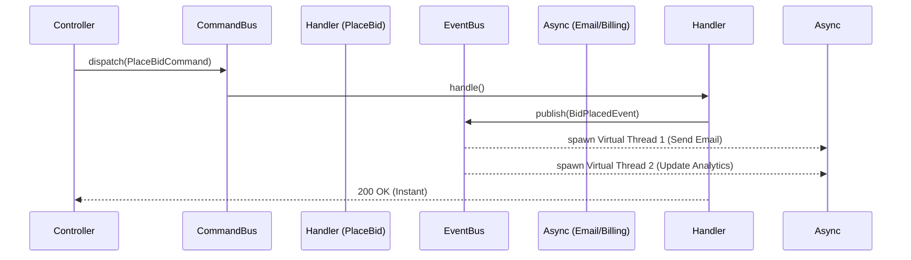

# Event Manager & Pub/Sub

The `ferrox-java-event-manager` module brings highly scalable **Event-Driven Architecture (EDA)** into the JVM, utilizing Project Loom (Virtual Threads) to decouple bounded contexts.

---

## 1. What It Is & Architectural Purpose

In a traditional monolith, when an Auction is won, the `AuctionService` directly calls the `EmailService`, the `BillingService`, and the `AnalyticsService`. If the `EmailService` is slow, the entire transaction blocks.

**Ferrox Event Manager** decouples these operations. The `AuctionService` simply emits an `AuctionWonEvent` to the in-memory `EventBus` and returns `200 OK` to the user immediately. The other services listen for this event and process it asynchronously.

---

## 2. What It Does & Key Capabilities

- **Virtual Thread Backing:** Every event handler is spawned on a new Virtual Thread (`Executors.newVirtualThreadPerTaskExecutor()`). This means you can process 1,000,000 background events concurrently without exhausting OS threads.
- **Strong Typing:** Domain Events implement `DomainEvent` with a guaranteed `eventId` and `occurredOn` timestamp.
- **Zero Configuration:** Leverages the Spring `ApplicationContext` to automatically discover and route events to classes implementing `EventHandler<T>`.

---

## 3. How It Works Under the Hood



---

## 4. Why It Was Designed This Way

| Feature | `@Async` / Spring Events | Ferrox EventBus |
| :--- | :--- | :--- |
| **Thread Pool** | Requires tuning a `ThreadPoolTaskExecutor`. Prone to starvation. | Zero tuning. Unlimited Virtual Threads. |
| **API Surface** | Relies on `@EventListener` magic. Hard to track. | Explicit `EventHandler<T>` interfaces. Type-safe and traceable. |

---

## 5. Practical Usage Guide

### Defining an Event
```java
public record BidPlacedEvent(String eventId, Instant occurredOn, String auctionId, double amount) implements DomainEvent {}
```

### Publishing an Event
```java
eventBus.publish(new BidPlacedEvent(UUID.randomUUID().toString(), Instant.now(), "auc-123", 500.0));
```

### Listening to an Event
```java
@Service
public class AnalyticsListener implements EventHandler<BidPlacedEvent> {
    @Override
    public void onEvent(BidPlacedEvent event) {
        // Runs on a new Virtual Thread automatically
        database.saveAnalytics(event);
    }
}
```

---

## 6. Anti-Patterns: How NOT to Use It

> [!CAUTION]
> **Anti-Pattern 1: Transactional Assumptions**
> Do not assume that an asynchronous `EventHandler` runs in the same Database Transaction as the publisher. If the main transaction rolls back, the event has already been fired! Use the Outbox Pattern if transactional consistency is strictly required.
