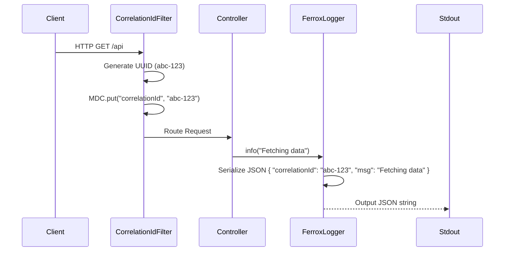

# Observability, JSON Logging & MDC

The `ferrox-java-observability` module standardizes distributed tracing and high-performance structured logging, inspired by Node.js `pino`.

---

## 1. What It Is & Architectural Purpose

When investigating a bug in a distributed microservices environment, it is impossible to trace a request across logs unless every single log line shares a unique ID. Furthermore, unstructured text logs (`[INFO] User logged in`) are useless to log aggregators like ELK or Datadog.

**Ferrox Observability** injects a unique `x-correlation-id` into every incoming HTTP request and outputs all logs in heavily structured, indexable JSON.

---

## 2. What It Does & Key Capabilities

- **Automatic Correlation ID:** The `CorrelationIdFilter` assigns a UUID to incoming requests and places it in the `MDC` (Mapped Diagnostic Context).
- **Fast JSON Logging:** `FerroxLogger` bypasses standard logback XML configurations to emit raw, serialized JSON strings.
- **PII Redaction:** Automatically detects sensitive dictionary keys (`password`, `token`, `secret`) and replaces them with `[REDACTED]`.

---

## 3. How It Works Under the Hood



---

## 4. Why It Was Designed This Way

| Feature | Standard SLF4J / Logback | Ferrox Observability |
| :--- | :--- | :--- |
| **Output Format** | Plain text. Requires complex Grok parsing in Logstash. | Native JSON. Instantly parsed by Datadog / Elasticsearch. |
| **Security** | Developers accidentally log passwords in plain text. | Automatic Redaction of sensitive payload keys. |

---

## 5. Practical Usage Guide

### Using the Logger

```java
import dev.ferrox.observability.FerroxLogger;
import java.util.Map;

public class PaymentService {
    private final FerroxLogger log = new FerroxLogger(PaymentService.class);

    public void process(String cardToken, int amount) {
        log.info("Processing payment", Map.of(
            "amount", amount,
            "token", cardToken // Automatically REDACTED!
        ));
    }
}
```

**Output:**
```json
{
  "time": "2026-09-19T21:00:00Z",
  "level": "INFO",
  "msg": "Processing payment",
  "correlationId": "8f8b3c-1293a",
  "ctx": {
    "amount": 500,
    "token": "[REDACTED]"
  }
}
```

---

## 6. Anti-Patterns: How NOT to Use It

> [!CAUTION]
> **Anti-Pattern 1: Async MDC Loss**
> Standard Java ThreadPools do not copy the `MDC` context. If you spawn a manual thread (`new Thread()`), the `correlationId` is lost. Always use the Ferrox-provided `TaskDecorators` or explicit Context Propagation when leaving the request thread.
