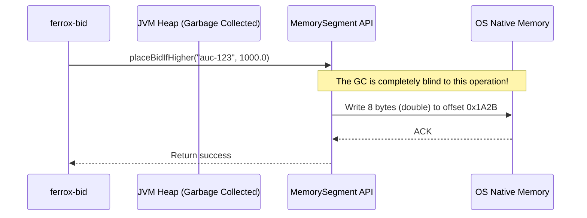

# Off-Heap Native Memory (Zero-GC)

The `ferrox-java-offheap` module demonstrates absolute mastery over the JVM by bypassing the Garbage Collector entirely. Using Java 21's **Foreign Function & Memory API (Project Panama)**, it allocates memory directly in the OS RAM.

---

## 1. What It Is & Architectural Purpose

In High-Frequency Trading (HFT) or real-time bidding engines like `ferrox-bid`, latency consistency is everything. 

Standard Java applications store data in the JVM Heap (e.g., `ConcurrentHashMap`). When the Heap fills up, the JVM pauses the entire application to run the Garbage Collector (GC). These "Stop-The-World" pauses can last hundreds of millisecond—an eternity in HFT.

**Ferrox Off-Heap** solves this by storing the hot data (the current highest bids) in native OS memory (like a C/Rust application would). The JVM Garbage Collector cannot see this memory, meaning GC pauses are structurally eliminated.

---

## 2. What It Does & Key Capabilities

- **Zero-GC Allocations:** Bids are written and read directly from Native RAM via `MemorySegment`.
- **Project Panama Native:** Uses the modern, safe `java.lang.foreign.Arena` API introduced in Java 21, replacing the deprecated and dangerous `sun.misc.Unsafe`.
- **Extreme Throughput:** Because memory access is direct and not subject to object graph traversals by the GC, read/write latency is deterministic.

---

## 3. How It Works Under the Hood



---

## 4. Why It Was Designed This Way

| Feature | Standard `ConcurrentHashMap` | Ferrox Off-Heap Arena |
| :--- | :--- | :--- |
| **GC Impact** | High. Millions of objects cause frequent Stop-The-World pauses. | Zero. The GC doesn't track `MemorySegment` data. |
| **Memory Density** | Low. Each Java Object has a 16-byte object header overhead. | High. A `double` takes exactly 8 bytes in RAM. |

---

## 5. Practical Usage Guide

### Instantiating the Arena

```java
import dev.ferrox.offheap.OffHeapAuctionCache;

@Service
public class BiddingService {
    
    // Automatically allocates memory in OS RAM upon startup
    private final OffHeapAuctionCache offHeap = new OffHeapAuctionCache();

    public void processBid(String auctionId, double amount) {
        // Writes directly to native memory
        offHeap.placeBidIfHigher(auctionId, amount);
    }
    
    public double getPrice(String auctionId) {
        // Reads directly from native memory
        return offHeap.getCurrentHighestBid(auctionId);
    }
}
```

---

## 6. Anti-Patterns: How NOT to Use It

> [!CAUTION]
> **Anti-Pattern 1: Memory Leaks**
> Unlike standard Java objects, Off-Heap memory is NOT garbage collected. If you do not call `arena.close()` when shutting down your application context, you will create a severe memory leak at the OS level. Always implement `AutoCloseable`.
