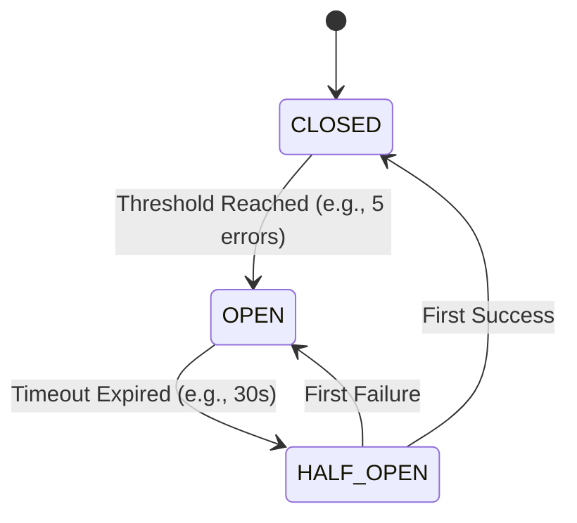

# Circuit Breaker & Resilience

The `ferrox-java-resilience` module provides robust fail-fast state machines to prevent cascading network failures across your microservices.

---

## 1. What It Is & Architectural Purpose

If your Java service relies on an external Rust microservice (`ferrox-auth`) or a 3rd party API (Stripe), and that API goes down, every HTTP request to your Java service will hang waiting for the external API to timeout (e.g., 30 seconds).

Within minutes, thousands of threads are blocked. Your service crashes, taking down the entire ecosystem.

The **Circuit Breaker** pattern acts as an electrical fuse. If it detects too many failures, it "trips" (OPEN state), immediately rejecting all subsequent calls with an `IllegalStateException` without even attempting the network request. This saves your resources and gives the downstream service time to recover.

---

## 2. What It Does & Key Capabilities

- **3-State Machine:** CLOSED (Normal), OPEN (Failing Fast), HALF_OPEN (Testing recovery).
- **Virtual Thread Optimized:** Uses lightweight `AtomicReference` and `AtomicInteger` instead of heavy synchronized blocks, making it perfect for Project Loom concurrency.

---

## 3. How It Works Under the Hood



---

## 4. Why It Was Designed This Way

| Feature | Resilience4J | Ferrox Circuit Breaker |
| :--- | :--- | :--- |
| **Complexity** | Massive dependency, complex configuration via application.yml. | Zero-dependency, lightweight, instantiated programmatically. |
| **Concurrency** | Optimized for traditional thread pools. | Pure Atomic variables, zero blocking for Virtual Threads. |

---

## 5. Practical Usage Guide

### Defining and using the Breaker

```java
import dev.ferrox.resilience.CircuitBreaker;

@Service
public class PaymentGateway {
    
    // Trip after 3 failures, wait 10 seconds before testing again
    private final CircuitBreaker breaker = new CircuitBreaker(3, 10);

    public String chargeCreditCard() throws Exception {
        return breaker.execute(() -> {
            // Expensive HTTP call to Stripe
            return stripeClient.charge();
        });
    }
}
```

---

## 6. Anti-Patterns: How NOT to Use It

> [!CAUTION]
> **Anti-Pattern 1: Wrapping Business Logic**
> Never wrap internal business logic (e.g., `calculateTax()`) in a Circuit Breaker. Circuit Breakers are strictly for **Network Boundaries** (Database calls, External HTTP APIs, gRPC calls).

> [!TIP]
> **Pro-Tip 1: Fallback Methods**
> Always catch the `IllegalStateException` thrown by an OPEN Circuit Breaker to return a graceful degradation to the user (e.g., "Payments are temporarily unavailable, try again later").
