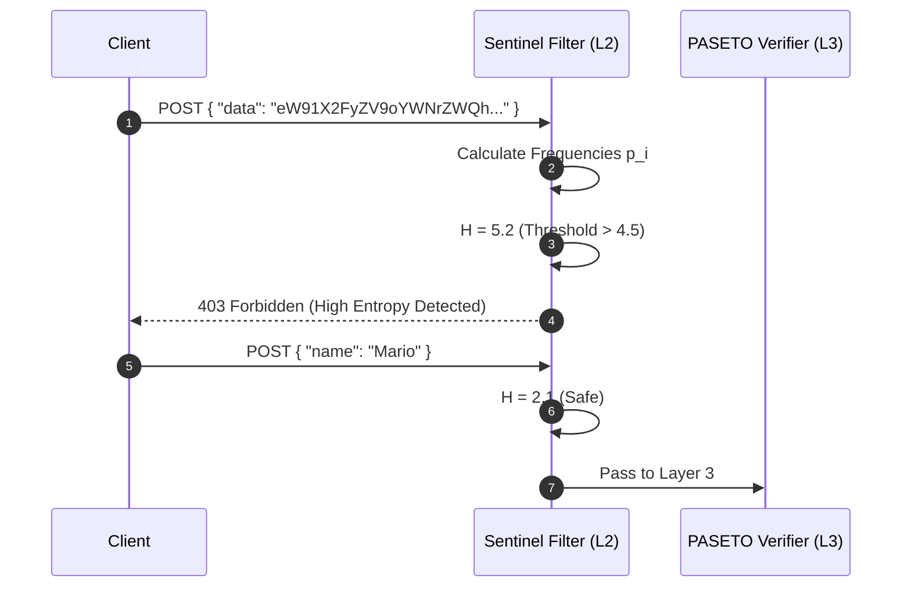

# Sentinel Threat Engine & Zero-Trust Auth

The `ferrox-java-security` module delivers military-grade zero-trust authentication and state-of-the-art (SOTA) threat detection directly into the Spring Boot pipeline, achieving 1:1 cryptographic parity with `ferrox` (Rust).

---

## 1. What It Is & Architectural Purpose

Standard API gateways rely on naive rate-limiters (IP frequency) and JWTs (JSON Web Tokens). 
- JWTs are vulnerable to Algorithm Confusion attacks (`alg: none`) and forged signatures.
- Naive rate-limiters fail against distributed, slow-loris, or highly obfuscated payload attacks (e.g., encoded shellcode or complex SQL injections).

**Ferrox-Java** solves this by implementing **PASETO v4 (Platform-Agnostic Security Tokens)** backed by BouncyCastle, and the **Sentinel Threat Engine** which analyzes the mathematical entropy of incoming JSON payloads.

---

## 2. What It Does & Key Capabilities

- **Shannon Entropy Analysis:** Calculates the randomness (entropy) of every incoming payload. If a payload is heavily obfuscated or contains raw binary shellcode, its entropy spikes, and the request is instantly dropped.
- **PASETO v4 Cryptography:** Uses `XChaCha20-Poly1305` authenticated encryption. It is impossible for an attacker to tamper with or downgrade the algorithm.
- **Argon2id Hashing:** Standardized memory-hard password hashing, entirely compatible with the Rust backend.
- **Method-Level Security:** `@RequireRole` annotations seamlessly integrate with the Pipeline.

---

## 3. How It Works Under the Hood

### The Sentinel Entropy Calculation

The `SentinelThreatEngine` calculates the Shannon Entropy ($H$) of a string using the formula:
$$ H = - \sum_{i} p_i \log_2(p_i) $$



---

## 4. Why It Was Designed This Way

| Feature | Standard Spring Security (JWT) | Ferrox-Java Security (PASETO + Sentinel) |
| :--- | :--- | :--- |
| **Algorithm Negotiation** | Header specifies `alg`. Vulnerable to manipulation. | No `alg` header. Always uses `v4.local` (XChaCha20). Immutable. |
| **Payload Inspection** | Blindly parses JSON into DTOs (Risk of Jackson Deserialization exploits). | Sentinel analyzes mathematical structure *before* Jackson parses the JSON. |
| **Cross-Language** | Often relies on BCrypt. | Uses Argon2id (IETF standard) for Rust/Java interoperability. |

---

## 5. Practical Usage Guide

### Generating a Token

```java
import dev.ferrox.security.PasetoTokenService;

@Service
public class AuthService {
    public String login(String userId) {
        // Uses BouncyCastle underneath to generate V4 Local token
        return pasetoTokenService.generateToken(userId, "ADMIN");
    }
}
```

### Protecting an Endpoint

```java
import dev.ferrox.security.RequireRole;

@RestController
public class SecretController {
    
    @PostMapping("/api/nukes")
    @RequireRole("ADMIN")
    public void launch() {
        // Only valid PASETO tokens with role "ADMIN" can reach here.
    }
}
```

---

## 6. Anti-Patterns: How NOT to Use It

> [!CAUTION]
> **Anti-Pattern 1: Bypassing Layer 2**
> Never disable the `SentinelFilter` for public endpoints "to increase speed". The entropy calculation takes less than `0.1ms` and is your primary defense against Zero-Day Jackson deserialization vulnerabilities.

---

## 7. Pro-Tips & Best Practices

> [!TIP]
> **Pro-Tip 1: Tuning Entropy Thresholds**
> The default Shannon Entropy threshold is `4.5`. If you are transmitting base64 encoded images or strictly compressed data via JSON strings, you must bypass the Sentinel path or raise the threshold to `5.5` for those specific URIs.
