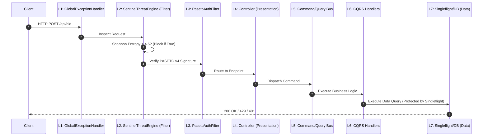

# Introduction & The 7-Layer Onion Pipeline

Welcome to **Ferrox-Java**, the enterprise-grade Java 21 adaptation of the Rust `ferrox` ecosystem. It leverages Spring Boot and Project Loom (Virtual Threads) to deliver extreme concurrency, zero-trust security, and metaprogramming paradigms traditionally reserved for low-level systems.

---

## 1. What It Is & Architectural Purpose

Traditional Spring Boot applications suffer from tight coupling (the classic Controller -> Service -> Repository layered monolith). **Ferrox-Java** discards this in favor of the **7-Layer Onion Pipeline** and strict **CQRS** (Command Query Responsibility Segregation). 

Its purpose is to provide the JVM ecosystem with the exact same security guarantees (PASETO v4, Argon2id) and performance optimizations (Cache Stampede Prevention via Singleflight) found in the Rust `ferrox` core, ensuring perfect interoperability across microservices.

```
┌────────────────────────────────────────────────────────────────────────┐
│                        FERROX-JAVA WORKSPACE                           │
├───────────────┬────────────────┬───────────────┬───────────────────────┤
│ ferrox-core   │ ferrox-security│ ferrox-cqrs   │ ferrox-crud-gen       │
├───────────────┴────────────────┴───────────────┴───────────────────────┤
│ ferrox-data (Singleflight)  │  ferrox-web (Pipeline AutoConfiguration) │
└────────────────────────────────────────────────────────────────────────┘
```

---

## 2. Core Architectural Philosophy

### 1. Project Loom (Virtual Threads) Native
Ferrox-Java completely bypasses Reactive Programming (WebFlux/Reactor) complexity. By enabling Java 21 Virtual Threads natively (`spring.threads.virtual.enabled=true`), it handles millions of concurrent blocking I/O calls (Database, HTTP clients) synchronously, mapped transparently to a handful of carrier OS threads.

### 2. Zero-Overhead Compile-Time Metaprogramming
Unlike Hibernate or Spring Data Rest which rely heavily on slow runtime Reflection, Ferrox-Java uses **Annotation Processing Tool (APT)**. Schemas are generated at `javac` compile time, ensuring 0ms startup penalty.

### 3. Absolute Zero-Trust Security
Security is handled at Layer 2 of the Onion Pipeline. Malicious traffic is stopped *before* it reaches any domain logic using Shannon Entropy payload analysis.

---

## 3. The 7-Layer Onion Pipeline

Ferrox-Java processes every incoming HTTP request through a strict sequence.



---

## 4. Next Steps
Browse the detailed component documentation in the sidebar to understand how Ferrox-Java prevents dogpiling (`ferrox-data`), encrypts identities (`ferrox-security`), and generates code (`ferrox-crud-gen`).
