# 🛡️ Zero-Trust API Gateway Pattern

In enterprise microservice architectures, authenticating requests against a database across 50 separate microservices creates massive database connection bottlenecks and security perimeters.

Ferrox implements the **Zero-Trust API Gateway Pattern**, decrypting PASETO/JWT tokens centrally at the edge gateway and injecting cryptographically trusted headers into internal microservice networks.

---

## 1. Gateway Architecture Flow

```mermaid
sequenceDiagram
    participant Client
    participant Gateway as Ferrox API Gateway
    participant OrdersMS as Orders Microservice
    participant DB as Orders DB

    Client->>Gateway: POST /api/v1/orders (Bearer PASETO Token)
    
    rect rgb(40, 40, 40)
        note right of Gateway: CPU-Bound PASETO Decryption (<20µs)
        Gateway->>Gateway: Verify PASETO v4 Symmetric Key
    end
    
    Gateway->>OrdersMS: Forward Request + Header (X-Ferrox-User-Id: 101)
    
    rect rgb(30, 50, 30)
        note right of OrdersMS: Zero-Trust Internal Network
        OrdersMS->>OrdersMS: Trust X-Ferrox-User-Id Header (No JWT parsing)
    end
    
    OrdersMS->>DB: Execute Query for User 101
    DB-->>OrdersMS: Order Entity
    OrdersMS-->>Gateway: 201 Created
    Gateway-->>Client: 201 Created JSON
```



---

## 2. API Gateway Implementation

```rust
use axum::{
    body::Body,
    http::{Request, HeaderValue},
    middleware::Next,
    response::Response,
};
use ferrox_security::paseto::PasetoAuth;
use ferrox_errors::AppError;

pub async fn gateway_paseto_translator(
    auth: PasetoAuth,
    mut req: Request<Body>,
    next: Next,
) -> Result<Response, AppError> {
    // 1. Extract Bearer Token
    let token = req.headers()
        .get("Authorization")
        .and_then(|v| v.to_str().ok())
        .and_then(|h| h.strip_prefix("Bearer "))
        .ok_or_else(|| AppError::Unauthorized("Missing authorization token".into()))?;

    // 2. Cryptographic PASETO Decryption (Stateless CPU operation)
    let claims = auth.validate_token(token)?;

    // 3. Inject internal trusted header
    req.headers_mut().insert(
        "X-Ferrox-User-Id",
        HeaderValue::from_str(&claims.sub).unwrap(),
    );

    // 4. Forward mutated request into internal VPC network
    Ok(next.run(req).await)
}
```
\n\n---\n\n## 1. Philosophy / Purpose\n\n*Document the philosophy and core purpose of this component here.*\n\n## 3. How it Works (Under the hood)\n\n*Detail the internal mechanics, memory model, and execution flow.*\n\n## 4. Why it was designed this way\n\n*Explain the historical context, trade-offs, and design rationale.*\n\n## 5. Usage Guide & Code Examples\n\n*Provide integration examples, setup guides, and typical use cases.*\n\n## 6. Anti-Patterns\n\n*List common mistakes, misconfigurations, and patterns to avoid when using this component.*\n\n## 7. Pro-Tips / Best Practices\n\n*Provide advanced tips, performance optimizations, and recommended patterns.*