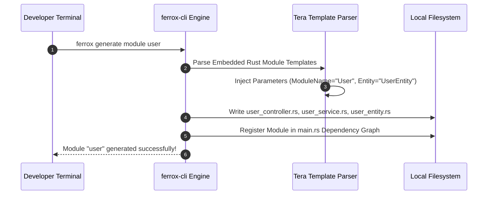

# Ferrox CLI Reference, Code Generators & Scaffolding

The `ferrox-cli` tool is the command-line interface for the Ferrox framework ecosystem. It automates project scaffolding, module code generation, database schema migrations, and self-test security diagnostic runners.

---

## 1. What It Is & Architectural Purpose

Building microservice architectures requires creating repetitive boilerplate code: controller classes, service files, DTO schemas, SeaORM entity models, and migration files. Doing this manually leads to inconsistent directory structures and typos.

`ferrox-cli` standardizes development workflows. It generates fully typed Rust code modules, scaffolds entire microservice projects, and runs framework self-tests directly from your terminal.

```
┌────────────────────────────────────────────────────────────────────────┐
│                               ferrox-cli                               │
├────────────────────────────────────────────────────────────────────────┤
│  • ferrox new <app-name>         (Project Scaffolder)                  │
│  • ferrox generate module <name> (Code Generator)                      │
│  • ferrox migrate run            (Database Migration Runner)            │
│  • ferrox selftest               (OWASP & Latency Diagnostic Suite)    │
└──────────────────────────────────┬─────────────────────────────────────┘
                                   │ Automated Rust Code Generation
                                   ▼
┌────────────────────────────────────────────────────────────────────────┐
│                        Target Microservice Project                     │
└────────────────────────────────────────────────────────────────────────┘
```

---

## 2. What It Does & Key Capabilities

- **`ferrox new <name>`**: Scaffolds a new Ferrox microservice with pre-configured Docker, Kubernetes, database, and tracing setups.
- **`ferrox generate controller <name>`**: Generates a strongly typed controller module with CRUD routes.
- **`ferrox migrate [run|revert|generate]`**: Runs, rolls back, or generates SeaORM SQL database schema migrations.
- **`ferrox selftest`**: Executes automated security compliance scans (OWASP WSTG checks) and latency benchmark suites.

---

## 3. How It Works Under the Hood

### Code Generation & Scaffolding Sequence



---

## 4. Why It Was Designed This Way

| Feature | Manual Boilerplate Creation | ferrox-cli Generator |
| :--- | :--- | :--- |
| **Speed** | 30+ minutes to structure a new service module by hand. | < 1 second automated code generation command. |
| **Consistency** | Different developers use varying file names and layouts. | Enforces identical architecture standards across all teams. |
| **Migrations** | Manually writing SQL schema files risks syntax bugs. | Auto-generates type-safe migrations from Rust entity structs. |

---

## 5. Practical Usage Guide & Extended Code Examples

### 5.1 CLI Command Operations

```bash
# Scaffolding a new microservice
ferrox new payment-service --template=microservice --db=postgres

# Generating a new domain module with CRUD routes
cd payment-service
ferrox generate module payment

# Running pending database migrations
ferrox migrate run

# Running framework security & latency self-test
ferrox selftest --suite=security,latency
```

---

## 6. Anti-Patterns: How NOT to Use It

> [!CAUTION]
> **Anti-Pattern 1: Editing Auto-Generated Files without Version Control**
> Before running `ferrox generate` commands, ensure your git working tree is clean so generated file additions can be inspected via `git diff`.

---

## 7. Pro-Tips & Best Practices

> [!TIP]
> **Pro-Tip 1: Custom Templates**
> Place a `.ferrox-templates/` directory in your workspace root to override default CLI scaffolding templates with custom company headers or architecture patterns.
