# 🔄 Request Lifecycle & Architecture

To truly understand how Ferrox achieves massive scale and uncompromising security, we must zoom out and look at the "Big Picture". 

A framework is only as good as its request lifecycle. If there is a single blocking chokepoint, your architecture will fail under load. Ferrox is designed as an **Onion Architecture**, where requests must pass through rigorous, non-blocking layers before ever touching your business logic.

## The Global Request Flow

When a client sends an HTTP request, it doesn't just hit the Controller. It goes through a strictly enforced pipeline.

```mermaid
sequenceDiagram
    participant Client
    participant Proxy as Reverse Proxy (Nginx/Traefik)
    participant Tokio as Tokio Worker Thread
    participant Middleware as Global Middleware
    participant Guard as Auth Guard
    participant Pipe as Validation Pipe
    participant Controller
    participant Service as Fat Provider (Service)
    participant DB as Database

    Client->>Proxy: POST /api/tickets
    Proxy->>Tokio: Forward TCP Stream
    
    rect rgb(30, 30, 30)
        note right of Tokio: Ferrox Application Boundary
        Tokio->>Middleware: 1. Logging & Rate Limiting
        
        alt Rate Limit Exceeded
            Middleware-->>Client: 429 Too Many Requests
        else Allowed
            Middleware->>Guard: 2. Extract JWT & Verify
        end
        
        alt Invalid Signature
            Guard-->>Client: 401 Unauthorized
        else Valid Signature
            Guard->>Pipe: 3. Deserialize JSON & Validate DTO
        end
        
        alt Invalid Email Format
            Pipe-->>Client: 400 Bad Request
        else Valid Data
            Pipe->>Controller: 4. Execute Route Handler
        end
        
        Controller->>Service: 5. Delegate Business Logic
    end
    
    Service->>DB: 6. Asynchronous Query
    DB-->>Service: Result
    
    Service-->>Controller: Return Entity
    Controller-->>Client: 201 Created (JSON)
```



### Why this matters (The "Fail Fast" Philosophy)

Notice the `alt` branches in the diagram. Ferrox employs a **"Fail Fast"** philosophy. 
If a user sends an invalid JSON payload, the `Validation Pipe` rejects the request and returns a `400 Bad Request` *before* the Controller or the Database is ever invoked.

This mathematically guarantees that your business logic (the Service) only ever operates on sanitized, authenticated, and authorized data, saving massive amounts of CPU cycles and database connections.

---

## The Zero-Trust Microservice Data Flow

In a monolithic application, authentication is simple: the server checks a session cookie against the database. In a distributed Microservice Architecture, checking the database for every single request across 50 microservices will instantly crash your database cluster.

Ferrox solves this using the **Zero-Trust API Gateway Pattern**.

```mermaid
graph TD
    Client((Client)) -->|Bearer Token (PASETO)| Gateway[Ferrox API Gateway]
    
    subgraph Zero-Trust Perimeter
        Gateway -->|Cryptographic Verification| Gateway
        Gateway -->|Inject X-Ferrox-User-Id| Internal[Internal Network]
        
        Internal -->|Trusts Header| MS1[Orders Microservice]
        Internal -->|Trusts Header| MS2[Inventory Microservice]
        Internal -->|Trusts Header| MS3[Payments Microservice]
    end
    
    MS1 -.-> DB[(Orders DB)]
    MS2 -.-> DB2[(Inventory DB)]
    
    style Gateway fill:#8f4a1c,stroke:#fff,stroke-width:2px
    style MS1 fill:#1a1a1a,stroke:#444,stroke-width:1px
    style MS2 fill:#1a1a1a,stroke:#444,stroke-width:1px
    style MS3 fill:#1a1a1a,stroke:#444,stroke-width:1px
```

### The Mechanism:
1. The **API Gateway** acts as the singular entry point. It holds the Symmetric Encryption Key.
2. The Gateway receives the request and decrypts the PASETO token in microseconds (CPU-bound, no DB lookup).
3. If valid, the Gateway creates a mutated clone of the HTTP Request, injecting a strict internal header: `X-Ferrox-User-Id: 12345`.
4. The internal microservices (`Orders`, `Inventory`) don't even have a JWT decoding library. They blindly trust the `X-Ferrox-User-Id` header, because their firewalls only allow traffic originating from the API Gateway.

This architecture scales infinitely because Authentication becomes a stateless CPU operation rather than a stateful I/O operation.
