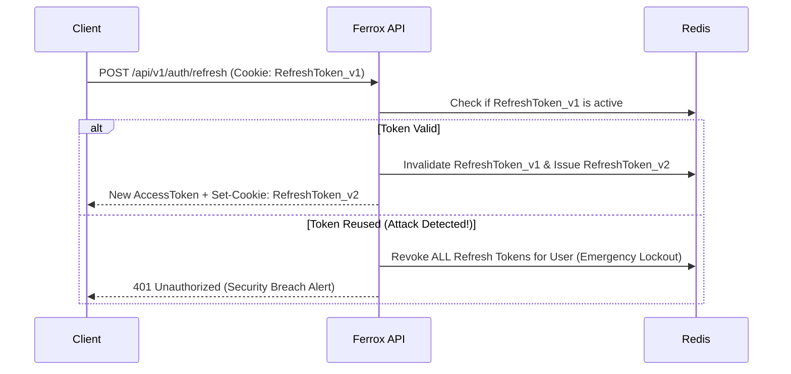

# 🔑 Advanced Security: Dual Tokens & PublicId Obfuscation

Basic JWT authentication often suffers from two enterprise security vulnerabilities:
1. **Long-Lived Token Vulnerability**: If a single JWT access token is stolen, an attacker retains access until the token expires (hours or days later).
2. **Sequential ID Enumeration Attacks**: Exposing raw database auto-increment IDs (`/users/1`, `/users/2`) allows malicious bots to scrape customer data.

Ferrox solves both issues via `ferrox-security`: **Dual-Token Refresh Rotation** and `PublicId` URL obfuscation.

---

## 1. Dual-Token Refresh Rotation Architecture

Ferrox uses a two-token system:
- **Access Token**: Short-lived (15 minutes), stateless PASETO v4 token sent in Authorization headers.
- **Refresh Token**: Long-lived (7 days), single-use token stored securely in HttpOnly cookies and tracked in Redis with **Refresh Token Rotation**.



### Automatic Breach Detection

If an attacker attempts to reuse an already-invalidated refresh token, Ferrox detects token family reuse, immediately revokes **all** active refresh tokens for that user ID in Redis, and forces a re-login.

---

## 2. Preventing Enumeration Attacks with `PublicId`

Auto-incrementing integer IDs (`u64`) leak your total business volume (e.g. `order/10005` reveals you have 10,005 orders).

`ferrox-security` provides `PublicId`—a type-safe obfuscation wrapper converting raw internal IDs into cryptographically secure, non-sequential NanoIDs or Sqids for HTTP URLs:

```rust
use ferrox_security::public_id::PublicId;
use serde::{Deserialize, Serialize};

#[derive(Serialize, Deserialize)]
pub struct UserDto {
    // Internal DB ID = 42, Public API ID = "usr_k8F9x2M1"
    pub id: PublicId<u64>,
    pub username: String,
}
```

---

## 3. ✅ Best Practices

- **Never expose raw database primary keys in public APIs**: Use `PublicId` to prevent competitive scraping and enumeration attacks.
- **Store Refresh Tokens in HttpOnly, SameSite=Strict cookies**: Protect client applications against Cross-Site Scripting (XSS) token theft.
