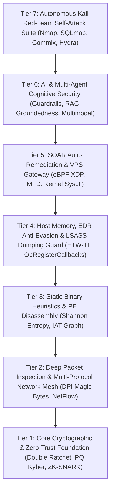

# 🤖 Ferrox Sentinel: AI/ML Security Engine, 37 SOTA Innovations & Kernel Hardening

**Ferrox Sentinel** (`ferrox-sentinel` v0.6.0) is an enterprise-grade AI/ML security analytics, threat detection, and kernel defense mesh built directly into the Ferrox framework.

Designed for high-throughput zero-trust architectures, game servers, cloud microservices, and AI/LLM backends, Sentinel synthesizes **37 State-of-the-Art (SOTA) security innovations** and deep **Linux Kernel Hardening** (Seccomp BPF, Landlock LSM, sysctl profiles, eBPF/XDP) extracted from **11 authoritative technical security and AI publications**.

---

## 🏛️ 7-Tier Synergistic Security Mesh Architecture

Ferrox Sentinel structures its security innovations into a 7-tier operational pyramid anchored directly into the host OS kernel:



---

## 📖 Key Additions in v0.6.0: Kernel-Rooted VPS Protection & Kali Red-Team

| Module | Literature Source | Technical Description |
|---|---|---|
| `seccomp_landlock_sandbox.rs` | *Linux Kernel LSM & BPF Docs* | **Seccomp BPF & Landlock LSM Sandbox**: Restricts syscall execution space (blocking `execve`, `ptrace`, `kexec_load`) and isolates process filesystem boundaries against 0-day RCE exploits. |
| `kernel_sysctl_hardener.rs` | *Linux OS Hardening Standards* | **Linux Kernel Sysctl Hardening**: Generates `/etc/sysctl.d/99-ferrox-kernel-hardening.conf` enforcing `tcp_syncookies`, `kptr_restrict = 2`, `yama.ptrace_scope = 3`, and `rp_filter = 1` against local privilege escalation and spoofing. |
| `kali_audit_runner.rs` | *OWASP WSTG & Kali Offensive Suite* | **Containerized Kali Red-Team Runner**: Orchestrates automated penetration tests (Nmap, Gobuster, SQLmap, Commix, Hydra) directly against Ferrox instances. |

---

## ⚡ Quick Start & Usage

Add `ferrox-sentinel` to your `Cargo.toml`:

```toml
[dependencies]
ferrox-sentinel = "0.6.0"
```

### Generating Linux Kernel Hardening Sysctl Profile

```rust
use ferrox_sentinel::algorithms::kernel_sysctl_hardener::KernelSysctlHardenerEngine;

fn main() {
    let profile = KernelSysctlHardenerEngine::generate_sysctl_profile();
    println!("Generated /etc/sysctl.d/99-ferrox-kernel-hardening.conf:\n");
    println!("{}", profile.generated_sysctl_conf);
}
```

### Generating Seccomp BPF Syscall Filter

```rust
use ferrox_sentinel::algorithms::seccomp_landlock_sandbox::SeccompLandlockSandboxEngine;

fn main() {
    let seccomp_profile = SeccompLandlockSandboxEngine::generate_seccomp_profile();
    println!("Default Action: {}", seccomp_profile.default_action);
    println!("Blocked Syscalls: {:?}", seccomp_profile.blocked_syscalls);
}
```

---

## 🛠️ Benchmark & Red-Team Verification

All innovations and kernel hardening policies are continuously tested and validated using `ferrox-selftest`:

```bash
cargo test -p ferrox-sentinel -p ferrox-selftest
```
