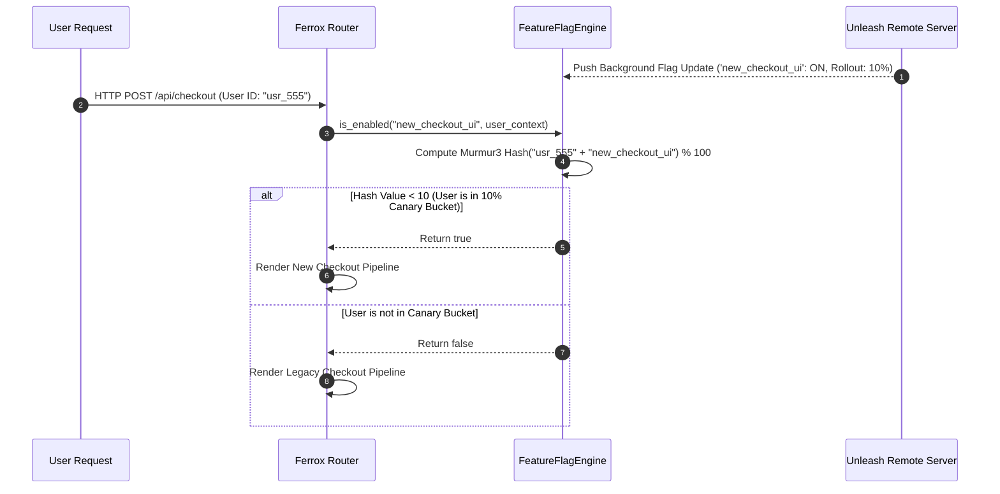

# Feature Flags, Dynamic Toggles & Unleash / LaunchDarkly

The `ferrox-integrations` feature flag engine provides dynamic feature evaluation, percentage-based canary rollouts, user segment targeting, and seamless integrations with Unleash, LaunchDarkly, and Redis configuration providers in Rust.

---

## 1. What It Is & Architectural Purpose

Deploying new features directly to production without feature flags forces engineering teams to rely on high-risk, all-or-nothing software releases. Rolling back buggy code requires deploying new container images, causing downtime.

The `FeatureFlagEngine` in Ferrox provides dynamic, in-memory feature evaluation. It allows toggling features instantly in production, targeting specific user segments, executing percentage canary releases (e.g., 5% rollout), and executing fallback code paths cleanly.

```
┌────────────────────────────────────────────────────────────────────────┐
│                      Ferrox FeatureFlagEngine                          │
├──────────────────────────────────┬─────────────────────────────────────┤
│  Local In-Memory Cache (0ms)     │  Remote Provider Synchronizer       │
│  • Evaluation Engine             │  • Unleash Server                   │
│  • Percentage Rollout Hashing    │  • LaunchDarkly / Redis Relay       │
└────────────────┬─────────────────┴──────────────────┬──────────────────┘
                 │ Dynamic Evaluation
                 ▼
┌────────────────────────────────────────────────────────────────────────┐
│                        Rust Domain Controller                          │
└────────────────────────────────────────────────────────────────────────┘
```

---

## 2. What It Does & Key Capabilities

- **Zero-Latency Local Evaluation**: Evaluates flags against cached local state in 0ms without making blocking network requests on every user hit.
- **Percentage-Based Canary Rollouts**: Uses Murmur3 hashing to consistently assign users to canary feature buckets across requests.
- **User Segment & Attribute Targeting**: Evaluates rules against user context (`user.role == 'BETA_TESTER'`, `user.country == 'US'`).
- **Unleash & LaunchDarkly Adapters**: Syncs flags in real-time via WebSocket streaming or HTTP polling.

---

## 3. How It Works Under the Hood

### Feature Flag Evaluation Sequence



---

## 4. Why It Was Designed This Way

| Feature | Hardcoded Code Branching | Ferrox FeatureFlagEngine |
| :--- | :--- | :--- |
| **Deployment Risk** | Code changes require full app re-deploy and pod restarts. | Instant feature toggle with zero downtime or pod restarts. |
| **Testing** | Difficult to test new features safely in production environments. | Target internal employees via `user.role == 'EMPLOYEE'` rules. |
| **Performance** | Network round-trip per request to remote flag service. | In-memory evaluation with background delta updates (0ms overhead). |

---

## 5. Practical Usage Guide & Extended Code Examples

### 5.1 Evaluating Feature Flags in Controllers

```rust
use ferrox_integrations::feature_flags::{FeatureFlagEngine, UserContext};

pub async fn checkout_handler(
    flag_engine: &FeatureFlagEngine,
    user: &UserContext,
) -> Result<Response, Error> {
    if flag_engine.is_enabled("v2_checkout_flow", user).await {
        println!("Serving V2 Checkout for user {}", user.id);
        execute_v2_checkout(user).await
    } else {
        println!("Serving V1 Legacy Checkout for user {}", user.id);
        execute_v1_checkout(user).await
    }
}
```

---

## 6. Anti-Patterns: How NOT to Use It

> [!CAUTION]
> **Anti-Pattern 1: Blocking Remote Network Calls per Request**
> Never fetch feature flag states directly over HTTP inside request handler paths. Always use `FeatureFlagEngine` in-memory local caching.

---

## 7. Pro-Tips & Best Practices

> [!TIP]
> **Pro-Tip 1: Stale Flag Cleanup**
> Schedule quarterly tech-debt sprints to remove old feature flag branch conditionals (`if is_enabled`) once features have reached 100% stable rollout.
