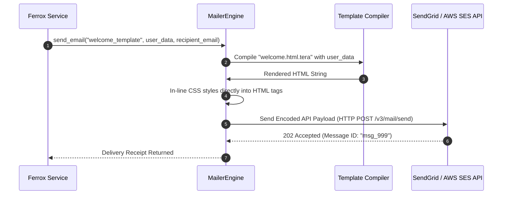

# Mailer Engine, HTML Email Templates & SMTP / SendGrid

The `mailer` module provides transactional email dispatching, HTML/CSS template compilation (via Handlebars/Tera), inline attachment embedding, and integrations with SendGrid, AWS SES, Mailgun, and raw SMTP servers in Rust.

---

## 1. What It Is & Architectural Purpose

Transactional email delivery (password resets, welcome emails, invoice receipts) is a critical component of web applications. Emails must be compiled with inline CSS styling, rendered from localized HTML templates, and delivered reliably through cloud email providers without leaking API secrets or stalling HTTP requests.

The `MailerEngine` in Ferrox abstracts transactional email sending. It compiles dynamic HTML templates, manages inline image attachments, and switches between SendGrid, AWS SES, and SMTP transports seamlessly.

```
┌────────────────────────────────────────────────────────────────────────┐
│                        Ferrox MailerEngine                             │
├──────────────────────────────────┬─────────────────────────────────────┤
│  HTML Template Compiler (Tera)   │  Multi-Provider Transport Switcher  │
│  • Inline CSS Auto-Inliner       │  • SendGrid / Mailgun API           │
│  • Attachment Manager            │  • AWS SES / Native SMTP Pool        │
└────────────────┬─────────────────┴──────────────────┬──────────────────┘
                 │ Transactional Email Dispatch
                 ▼
┌────────────────────────────────────────────────────────────────────────┐
│                        Recipient Email Inbox                           │
└────────────────────────────────────────────────────────────────────────┘
```

---

## 2. What It Does & Key Capabilities

- **Multi-Provider Transport Support**: Send emails via SendGrid REST API, AWS SES v2, Mailgun, Postmark, or standard SMTP TLS.
- **HTML Template Rendering**: Compiles dynamic Handlebars/Tera templates with inline CSS auto-inlining (Juice engine).
- **Inline Image & File Attachments**: Attaches binary files or inline CID image attachments (e.g., logo images).
- **DKIM & SPF Compatibility**: Signs email headers to prevent delivery to recipient spam folders.

---

## 3. How It Works Under the Hood

### Email Compilation & Delivery Sequence



---

## 4. Why It Was Designed This Way

| Feature | Raw SMTP Library | Ferrox MailerEngine |
| :--- | :--- | :--- |
| **Provider Locking**| Hardcoded to raw SMTP protocol. | Switch seamlessly between SendGrid, AWS SES, and SMTP via config. |
| **CSS Inlining** | External CSS stylesheets fail in Outlook and Gmail. | Automated CSS inlining ensures perfect rendering across email clients. |
| **Templates** | Un-safe string formatting (`format!("<p>Hello {}</p>")`). | XSS-safe HTML template compilation with parameter escaping. |

---

## 5. Practical Usage Guide & Extended Code Examples

### 5.1 Sending Transactional Emails

```rust
use ferrox_integrations::mailer::{MailerEngine, EmailMessage};

pub async fn send_welcome_email(
    user_email: &str,
    user_name: &str,
) -> Result<(), MailerError> {
    let mailer = MailerEngine::from_env()?;

    let email = EmailMessage::builder()
        .to(user_email)
        .subject("Welcome to Ferrox Framework!")
        .template("welcome", serde_json::json!({
            "name": user_name,
            "action_url": "https://example.com/activate",
        }))?
        .build()?;

    mailer.send(email).await?;
    Ok(())
}
```

---

## 6. Anti-Patterns: How NOT to Use It

> [!CAUTION]
> **Anti-Pattern 1: Un-inlined External CSS Files**
> Avoid linking external `<link rel="stylesheet">` tags in email templates. Popular email clients strip external stylesheets. Always allow `MailerEngine` to inline CSS styles directly.

---

## 7. Pro-Tips & Best Practices

> [!TIP]
> **Pro-Tip 1: Development Mail Trap**
> In local development (`NODE_ENV=development`), configure the MailerEngine to write emails to local HTML files or a Mailpit container to avoid sending real emails during testing.
