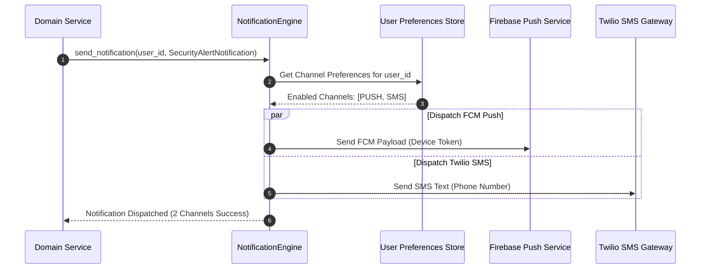

# Multi-Channel Notifications (Push, SMS, Slack, WebSockets)

The `notifications` module delivers multi-channel notification dispatching across APNs (Apple Push Notification service), FCM (Firebase Cloud Messaging), Twilio SMS, Slack Webhooks, Discord Webhooks, and WebSockets in Rust microservices.

---

## 1. What It Is & Architectural Purpose

Enterprise applications need to alert users across multiple channels (mobile push notifications for iOS/Android, SMS for multi-factor authentication, Slack webhooks for ops alerts, and WebSockets for real-time web banners). Managing separate API clients for every channel leads to duplicate notification logic.

The `NotificationEngine` in Ferrox provides a unified notification dispatcher. Developers define abstract `Notification` types, and Ferrox routes messages to target channels based on recipient preferences.

```
┌────────────────────────────────────────────────────────────────────────┐
│                      Ferrox NotificationEngine                         │
├──────────────────────────────────┬─────────────────────────────────────┤
│  Multi-Channel Dispatch Router   │  Template Interpolation Engine      │
│  • Preference Manager            │  • HTML / Markdown / Plain Text     │
└────────────────┬─────────────────┴──────────────────┬──────────────────┘
                 │ Dispatch Channels
      ┌──────────┼──────────┬──────────┬──────────────┤
      ▼          ▼          ▼          ▼              ▼
┌──────────┐┌──────────┐┌──────────┐┌──────────┐┌──────────────┐
│ FCM Push ││ APNs Push││Twilio SMS││ Slack    ││ WebSockets   │
└──────────┘└──────────┘└──────────┘└──────────┘└──────────────┘
```

---

## 2. What It Does & Key Capabilities

- **FCM & APNs Mobile Push**: Sends push notifications to iOS and Android devices with badges, sounds, and custom data payloads.
- **SMS Gateway Integrations**: Delivers SMS messages via Twilio, AWS SNS, and MessageBird.
- **Slack & Discord Webhook Channels**: Formats and dispatches rich Slack block-kit and Discord embed messages.
- **User Preference Routing**: Respects user opt-out preferences (`email: false`, `sms: true`, `push: true`).

---

## 3. How It Works Under the Hood

### Multi-Channel Dispatch Sequence



---

## 4. Why It Was Designed This Way

| Feature | Direct Third-Party SDK Calls | Ferrox NotificationEngine |
| :--- | :--- | :--- |
| **Channel Flexibility**| Hardcoded Twilio calls require rewriting code to switch to SNS. | Swap notification providers via configuration settings. |
| **User Preferences** | Manual `if (user.wants_sms)` boilerplate checks everywhere. | Automated channel filtering based on user preference tables. |
| **Resilience** | External SMS gateway timeout crashes caller. | Asynchronous dispatch queues prevent blocking main thread. |

---

## 5. Practical Usage Guide & Extended Code Examples

### 5.1 Dispatching Notifications across Channels

```rust
use ferrox_integrations::notifications::{NotificationEngine, NotificationMessage, Channel};

pub async fn notify_login_from_new_device(
    user_id: &str,
    ip_address: &str,
) -> Result<(), NotificationError> {
    let engine = NotificationEngine::new();

    let notification = NotificationMessage::builder()
        .recipient_id(user_id)
        .title("Security Alert: New Device Login")
        .body(&format!("A new login was detected from IP address: {}", ip_address))
        .channels(vec![Channel::Push, Channel::Sms])
        .build()?;

    engine.send(notification).await?;

    Ok(())
}
```

---

## 6. Anti-Patterns: How NOT to Use It

> [!CAUTION]
> **Anti-Pattern 1: Synchronous Multi-Channel Dispatch**
> Never block HTTP request threads waiting for third-party SMS or push notification APIs to complete. Always dispatch notifications asynchronously.

---

## 7. Pro-Tips & Best Practices

> [!TIP]
> **Pro-Tip 1: Rate-Limiting Alerts**
> Rate-limit security SMS alerts per user (e.g., max 3 SMS per hour) to prevent SMS toll-fraud attacks.
