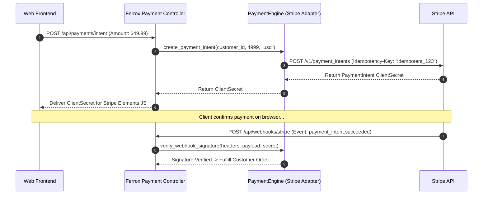

# Payment Gateway Integrations (Stripe, PayPal, Adyen) & Subscriptions

The `payments` module provides unified payment processing, recurring subscription billing lifecycle management, webhook signature verification, and multi-provider adapters for Stripe, PayPal, and Adyen in Rust microservices.

---

## 1. What It Is & Architectural Purpose

Integrating payment processors into e-commerce platforms and SaaS products requires handling complex transaction workflows: processing credit card charges, managing recurring subscription plans, handling payment failures, and verifying cryptographic webhook signatures.

The `PaymentEngine` in Ferrox abstracts payment providers into a single, type-safe Rust API (`PaymentProvider`). It ensures 100% PCI-DSS compliance by delegating raw credit card tokenization directly to payment provider SDKs while managing server-side customer billing state safely.

```
┌────────────────────────────────────────────────────────────────────────┐
│                        Ferrox PaymentEngine                            │
├──────────────────────────────────┬─────────────────────────────────────┤
│  Unified Payment Provider API    │  Cryptographic Webhook Verifier     │
│  • Charges & Refund Management   │  • Signature Verification (Stripe)  │
│  • Subscription Lifecycle Engine │  • Idempotency Header Validator     │
└────────────────┬─────────────────┴──────────────────┬──────────────────┘
                 │ Secure API Protocol
      ┌──────────┴────────────────────────────────────┴──────────┐
      ▼                                                          ▼
┌─────────────────────────────────┐              ┌───────────────────────┐
│ Stripe API Gateway              │              │ PayPal / Adyen API    │
└─────────────────────────────────┘              └───────────────────────┘
```

---

## 2. What It Does & Key Capabilities

- **Unified Payment Provider Trait**: Standardizes charges, refunds, customer profiles, and payment intent workflows.
- **Subscription Lifecycle Manager**: Manages subscription creation, plan upgrades, downgrades, cancellations, and grace periods.
- **Webhook Signature Verifier**: Verifies incoming Stripe/PayPal webhook signatures to prevent forged payment events.
- **Idempotent Transaction Execution**: Attaches unique idempotency keys (`Idempotency-Key`) to prevent double-charging users on network retries.

---

## 3. How It Works Under the Hood

### Payment Intent & Webhook Verification Sequence



---

## 4. Why It Was Designed This Way

| Feature | Direct Vendor SDK Hardcoding | Ferrox PaymentEngine |
| :--- | :--- | :--- |
| **Vendor Portability**| Code tied exclusively to Stripe SDK. | Switch between Stripe, PayPal, or Adyen without breaking domain logic. |
| **Double-Charge Risk**| Network retries can double-charge users without idempotency keys. | Automatic UUID idempotency key injection on all payment mutations. |
| **PCI Compliance** | High risk of handling raw credit card data on backend. | 100% tokenized flow. Backend handles only payment tokens & intent IDs. |

---

## 5. Practical Usage Guide & Extended Code Examples

### 5.1 Creating a Payment Intent

```rust
use ferrox_integrations::payments::{PaymentEngine, PaymentIntentRequest, Currency};

pub async fn initialize_checkout(
    customer_id: &str,
    amount_in_cents: i64,
) -> Result<String, PaymentError> {
    let payment_engine = PaymentEngine::stripe_from_env()?;

    let intent = payment_engine
        .create_payment_intent(PaymentIntentRequest {
            customer_id: customer_id.to_string(),
            amount: amount_in_cents,
            currency: Currency::USD,
            description: Some("Subscription Renewal".to_string()),
            idempotency_key: Some(format!("pay_intent_{}_{}", customer_id, amount_in_cents)),
        })
        .await?;

    Ok(intent.client_secret)
}
```

---

## 6. Anti-Patterns: How NOT to Use It

> [!CAUTION]
> **Anti-Pattern 1: Fulfilling Orders before Webhook Verification**
> Never grant user access or fulfill physical orders based solely on client-side frontend redirect callbacks. Always wait for cryptographically verified backend webhook events (`payment_intent.succeeded`).

---

## 7. Pro-Tips & Best Practices

> [!TIP]
> **Pro-Tip 1: Idempotency Key Design**
> Generate deterministic idempotency keys based on entity order IDs (`idempotency_key = format!("order_{}", order.id)`) to guarantee retried requests return the original charge object without duplicating billing.
