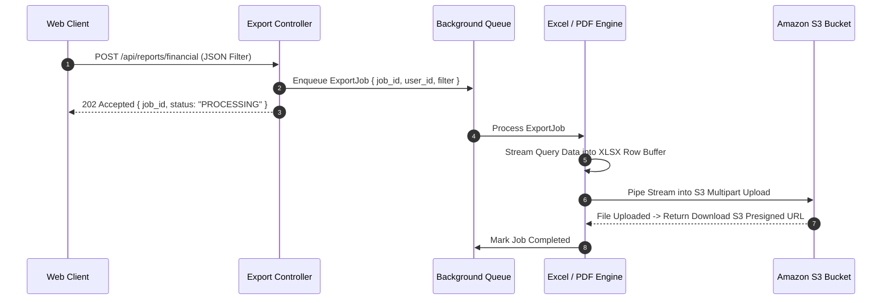

# PDF Report Generation, Excel Export & Cloud Providers

The `reports-and-cloud` module provides PDF document generation, streaming Excel (`.xlsx`) sheet generation, cloud storage integrations (AWS S3, Google Cloud Storage, Azure Blob), and asynchronous background export job handling for Rust applications.

---

## 1. What It Is & Architectural Purpose

Enterprise software requires exporting complex data tables into styled PDF invoices, multi-sheet Excel workbooks, and CSV dumps. Performing CPU-heavy PDF layout rendering or buffering millions of spreadsheet rows directly in application RAM leads to memory exhaustion and worker thread freezes.

`reports-and-cloud` delivers an asynchronous report generation pipeline. It streams Excel spreadsheet rows row-by-row and compiles PDF documents using headless Chrome or native typst engines in background worker pools before uploading target outputs to AWS S3.

```
┌────────────────────────────────────────────────────────────────────────┐
│                        ferrox-reports Engine                           │
├──────────────────────────────────┬─────────────────────────────────────┤
│  Streaming XLSX / CSV Writer     │  Headless PDF Render Pipeline       │
│  (Low RAM Allocation Writer)     │  (HTML/CSS -> PDF Template Engine)  │
└────────────────┬─────────────────┴──────────────────┬──────────────────┘
                 │ Asynchronous Upload Stream
                 ▼
┌────────────────────────────────────────────────────────────────────────┐
│                    Cloud Storage Bucket (AWS S3 / GCS)                 │
└────────────────────────────────────────────────────────────────────────┘
```

---

## 2. What It Does & Key Capabilities

- **Streaming XLSX Generation**: Writes spreadsheets with 500,000+ rows directly to S3 storage streams with minimal RAM usage.
- **HTML-to-PDF Template Engine**: Compiles dynamic HTML/handlebars templates into PDF documents with custom headers, footers, and page numbers.
- **Presigned Export Download Links**: Generates temporary, secure presigned S3 URLs for generated report downloads.
- **Async Background Export Worker**: Integrates with `ferrox-jobs` to run long exports off the main HTTP thread.

---

## 3. How It Works Under the Hood

### Background Report Generation & Upload Pipeline



---

## 4. Why It Was Designed This Way

| Feature | In-Memory String Concatenation | Ferrox Reports Pipeline |
| :--- | :--- | :--- |
| **RAM Usage** | Buffering 100MB CSV string in memory crashes process worker. | Row-by-row streaming allocation writes directly to S3 socket. |
| **HTTP Timeouts**| PDF generation blocking HTTP thread causes client gateway timeouts. | Asynchronous job queue returns 202 Accepted immediately. |
| **Storage Security**| Saving reports to local disk risks un-sanitized path overwrites. | Direct cloud S3 storage with temporary presigned download links. |

---

## 5. Practical Usage Guide & Extended Code Examples

### 5.1 Streaming Excel Report Generation

```rust
use ferrox_integrations::reports::{ExcelWriter, StorageProvider};

pub async fn generate_monthly_sales_report(
    sales_data: Vec<SalesRecord>,
) -> Result<String, ReportError> {
    let mut excel = ExcelWriter::new_stream("Monthly_Sales_Report")?;

    // Write header row
    excel.write_row(vec!["Order ID", "Customer", "Amount", "Date"])?;

    // Stream sales data rows
    for record in sales_data {
        excel.write_row(vec![
            &record.order_id,
            &record.customer_name,
            &record.amount.to_string(),
            &record.date.to_rfc3339(),
        ])?;
    }

    // Upload output stream to S3 bucket
    let download_url = excel
        .upload_to_s3("company-reports-bucket", "exports/sales_2026.xlsx")
        .await?;

    Ok(download_url)
}
```

---

## 6. Anti-Patterns: How NOT to Use It

> [!CAUTION]
> **Anti-Pattern 1: Synchronous PDF Generation on Main HTTP Handler**
> Never block HTTP request threads by generating 50-page PDF reports synchronously. Always offload report generation tasks to background queues.

---

## 7. Pro-Tips & Best Practices

> [!TIP]
> **Pro-Tip 1: Automatic Expiration Policy**
> Set Amazon S3 lifecycle rules on your export bucket to automatically delete generated report files after 7 days to keep cloud storage costs minimal.
