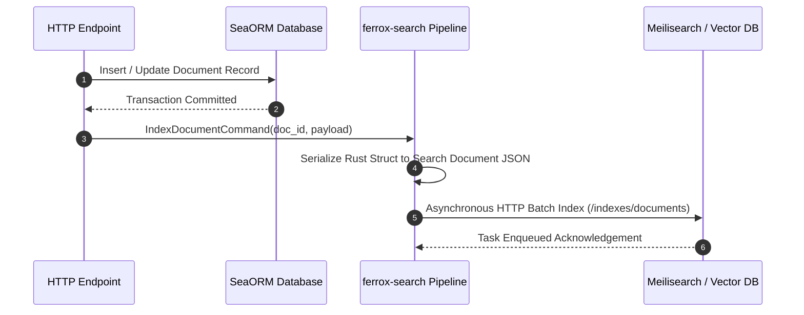

# Full-Text Search, Vector Indexing & Meilisearch Adapters

The `ferrox-search` crate delivers high-performance full-text search indexing, vector embedding search integration (OpenAI / Qdrant), and asynchronous index synchronization over Meilisearch and Elasticsearch clusters for Rust microservices.

---

## 1. What It Is & Architectural Purpose

Enterprise applications require searching through millions of structured and un-structured records with multi-language typo tolerance, faceted filtering, highlight snippets, and semantic vector similarity search. Making raw SQL `LIKE '%query%'` queries locks database CPU cores and delivers poor search experience.

`ferrox-search` abstracts external search engines into a unified Rust trait API (`SearchIndex<T>`). It handles asynchronous document indexing, automated schema mapping, vector embedding generation, and background sync queues without blocking request threads.

```
┌────────────────────────────────────────────────────────────────────────┐
│                          ferrox-search Engine                          │
├──────────────────────────────────┬─────────────────────────────────────┤
│  Async Document Indexer          │  Vector Embedding Engine            │
│  (Faceted Filter & Typo Tolerance)│  (Qdrant / Milvus / PgVector)       │
└────────────────┬─────────────────┴──────────────────┬──────────────────┘
                 │ Parameterized Search API
                 ▼                                    ▼
┌─────────────────────────────────┐  ┌──────────────────────────────────┐
│ Meilisearch Cluster             │  │ Elasticsearch / OpenSearch       │
└─────────────────────────────────┘  └──────────────────────────────────┘
```

---

## 2. What It Does & Key Capabilities

- **Faceted & Typo-Tolerant Search**: Provides multi-field search queries with configurable prefix matching, stop-words, and ranking rules.
- **Vector & Hybrid Search**: Computes vector embeddings and executes hybrid keyword-plus-vector semantic search queries.
- **Automatic Document Sync**: Integrates with SeaORM database mutations to index, update, or delete search documents asynchronously.
- **Highlighting & Snippet Generation**: Returns HTML-highlighted match snippets directly in Rust struct search responses.

---

## 3. How It Works Under the Hood

### Asynchronous Index Synchronization Sequence



---

## 4. Why It Was Designed This Way

| Feature | Direct SQL Searching | ferrox-search Engine |
| :--- | :--- | :--- |
| **Performance** | Table scan locks DB CPU on 1M+ rows (`LIKE '%term%'`). | Instant &lt;10ms inverted index search queries. |
| **Typo Tolerance** | Zero typo tolerance. Fails on minor misspellings. | Built-in Levenshtein distance typo tolerance. |
| **Semantic Search** | Requires manual vector DB integration. | Hybrid keyword + vector embedding search in a single trait. |

---

## 5. Practical Usage Guide & Extended Code Examples

### 5.1 Defining and Querying Search Documents

```rust
use ferrox_search::prelude::*;
use serde::{Deserialize, Serialize};

#[derive(Debug, Serialize, Deserialize, SearchDocument)]
#[search(index_name = "products", primary_key = "id")]
pub struct ProductDocument {
    pub id: String,
    #[search(searchable)]
    pub title: String,
    #[search(searchable)]
    pub description: String,
    #[search(filterable, sortable)]
    pub price: f64,
    #[search(filterable)]
    pub category: String,
}

pub async fn search_products(query: &str) -> Result<Vec<ProductDocument>, SearchError> {
    let search_engine = MeilisearchAdapter::new("http://localhost:7700", Some("masterKey"));

    let results = search_engine
        .query::<ProductDocument>("products")
        .with_query(query)
        .with_filter("price <= 100 AND category = 'electronics'")
        .with_limit(20)
        .execute()
        .await?;

    Ok(results.documents)
}
```

---

## 6. Anti-Patterns: How NOT to Use It

> [!CAUTION]
> **Anti-Pattern 1: Synchronous Indexing on HTTP Request Path**
> Avoid awaiting search index updates synchronously inside API write controllers. Always dispatch search indexing tasks asynchronously to background queues.

---

## 7. Pro-Tips & Best Practices

> [!TIP]
> **Pro-Tip 1: Batch Indexing**
> Use `search_engine.index_batch(documents)` when seeding initial datasets to upload up to 10,000 documents per HTTP payload.
