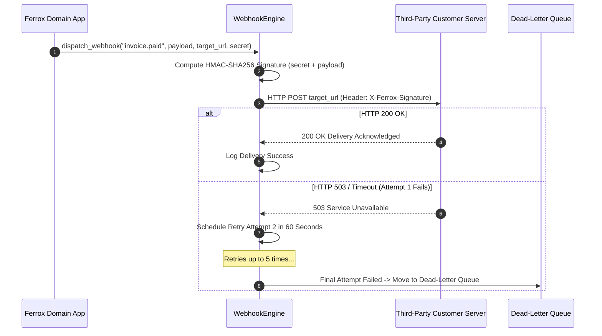

# Webhook Delivery Engine, HMAC Signatures & Exponential Retries

The `webhooks` module delivers outbound webhook notification pipelines. It features HMAC-SHA256 signature verification headers, exponential backoff retries, dead-letter queue (DLQ) routing, and payload delivery logging for Rust microservices.

---

## 1. What It Is & Architectural Purpose

Modern SaaS platforms send real-time event updates (e.g., `invoice.payment_succeeded`, `user.registered`) to third-party customer endpoint URLs via Webhooks. Delivering webhooks reliably over public internet networks requires handling client server downtime, timeout delays, and security verification.

The `WebhookEngine` in Ferrox automates reliable outbound webhook delivery. It signs payloads with HMAC-SHA256 signatures, manages exponential backoff retry attempts, and logs delivery receipts.

```
┌────────────────────────────────────────────────────────────────────────┐
│                        Ferrox WebhookEngine                            │
├──────────────────────────────────┬─────────────────────────────────────┤
│  HMAC-SHA256 Payload Signer      │  Exponential Backoff Retry Queue    │
│  (X-Ferrox-Signature Header)     │  (1m -> 5m -> 15m -> DLQ Router)     │
└────────────────┬─────────────────┴──────────────────┬──────────────────┘
                 │ HTTP POST Payload Delivery
                 ▼
┌────────────────────────────────────────────────────────────────────────┐
│                        Third-Party Customer Endpoint                   │
└────────────────────────────────────────────────────────────────────────┘
```

---

## 2. What It Does & Key Capabilities

- **HMAC-SHA256 Payload Signing**: Attaches cryptographic signature headers (`X-Ferrox-Signature: t=timestamp,v1=signature`) to prevent payload tampering.
- **Exponential Backoff Retries**: Retries failed delivery attempts with exponential delay intervals and jitter.
- **Dead-Letter Queue (DLQ) Routing**: Routes permanently failing webhooks (after 5 attempts) to a dead-letter storage queue for manual review.
- **Timestamp Anti-Replay Shield**: Includes timestamp signatures to protect customer endpoints against replay attacks.

---

## 3. How It Works Under the Hood

### Webhook Dispatch & Retry Sequence



---

## 4. Why It Was Designed This Way

| Feature | Direct Un-signed HTTP POST | Ferrox WebhookEngine |
| :--- | :--- | :--- |
| **Security** | Unsigned payloads risk spoofing by malicious actors. | Cryptographic HMAC-SHA256 signatures verify authenticity. |
| **Reliability** | Transient network glitches drop webhook events forever. | Automated exponential backoff retries preserve event delivery. |
| **Observability** | Zero visibility into whether webhooks reached customers. | Comprehensive delivery log receipts and DLQ management. |

---

## 5. Practical Usage Guide & Extended Code Examples

### 5.1 Dispatching Outbound Webhooks

```rust
use ferrox_integrations::webhooks::{WebhookEngine, WebhookPayload};

pub async fn notify_customer_payment(
    customer_url: &str,
    webhook_secret: &str,
    invoice_id: &str,
) -> Result<(), WebhookError> {
    let engine = WebhookEngine::new();

    let payload = WebhookPayload::new(
        "invoice.payment_succeeded",
        serde_json::json!({
            "invoice_id": invoice_id,
            "amount": 4999,
            "currency": "USD",
        }),
    );

    // Dispatch webhook with automated HMAC signing and retry policy
    engine.dispatch(customer_url, webhook_secret, payload).await?;

    Ok(())
}
```

---

## 6. Anti-Patterns: How NOT to Use It

> [!CAUTION]
> **Anti-Pattern 1: Omission of HMAC Signatures**
> Never dispatch webhooks without HMAC signature verification headers. Unsigned webhooks allow attackers to send fake event payloads to customer servers.

---

## 7. Pro-Tips & Best Practices

> [!TIP]
> **Pro-Tip 1: Webhook Secret Rotation**
> Provide dual-signature headers (`v1`, `v2`) during secret rotation periods so customers can migrate to new secrets without dropping events.
