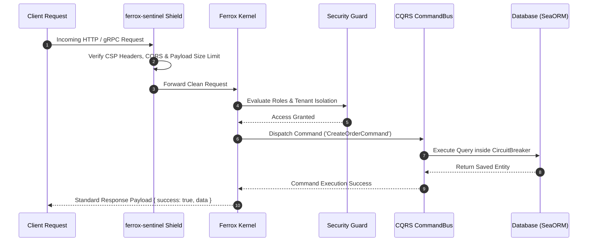

# Introduction & Ferrox Crate Architecture

Welcome to **Ferrox**, the enterprise-grade Rust web framework designed for building ultra-resilient microservices, multi-protocol API gateways, high-frequency real-time applications, and WebAssembly frontend clients.

---

## 1. What It Is & Architectural Purpose

Building production-ready software in Rust requires assembling multiple asynchronous crates: web servers (`Axum` / `Hyper`), ORMs (`SeaORM`), security modules, resilience tools, and logging engines. Without a unified framework, developers spend significant time configuring boilerplate code and managing dependency compatibility.

**Ferrox** provides a modular suite of 35+ specialized Rust crates. It delivers NestJS-style dependency injection ergonomics, zero-copy performance, end-to-end type safety, and production observability out of the box.

```
┌────────────────────────────────────────────────────────────────────────────────────────┐
│                                   YOUR FERROX APP                                      │
├────────────────────────────────────────────────────────────────────────────────────────┤
│  ferrox-app  │  ferrox-cqrs  │  ferrox-sentinel  │  ferrox-transports  │  ferrox-sync  │
├──────────────┴───────────────┴───────────────────┴─────────────────────┴───────────────┤
│                                 FERROX FRAMEWORK KERNEL                                │
├────────────────────────────────────────────────────────────────────────────────────────┤
│  Tokio Async Runtime  │  Hyper HTTP / Axum  │  SeaORM Database  │  Pino / Tracing Logs │
└────────────────────────────────────────────────────────────────────────────────────────┘
```

---

## 2. Comprehensive Crate Ecosystem Taxonomy

| Crate | Category & Domain | Key Feature |
| :--- | :--- | :--- |
| **`ferrox-app`** | Application Kernel | Application lifecycle bootstrap & dependency injection. |
| **`ferrox-circuit-breaker`**| Fault Tolerance | State machine (`Closed`, `Open`, `HalfOpen`) for remote APIs. |
| **`ferrox-cli`** | Command Line Tooling | Code generator, module scaffolder, migration runner. |
| **`ferrox-config`** | Dynamic Settings | Environment variable parsing with schema validation. |
| **`ferrox-cqrs`** | Architecture Pattern | Command Bus, Query Bus, and Event Sourcing dispatchers. |
| **`ferrox-crud-gen`** | Automated CRUD | Auto-generates REST/GraphQL CRUD routes from SeaORM entities.|
| **`ferrox-datagrid`** | Query Translation | Server-side AG-Grid / TanStack Table SeaORM query builder. |
| **`ferrox-errors`** | System Taxonomy | Type-safe error taxonomies with localized messages. |
| **`ferrox-events`** | Event Bus | In-process and distributed Kafka/AMQP event bus. |
| **`ferrox-graphql`** | Transport | Async-GraphQL schema stitching, scalars, and federation. |
| **`ferrox-guards`** | Security & Auth | Declarative RBAC / ABAC / Multi-Tenant access guards. |
| **`ferrox-health`** | Diagnostics | Health checks, readiness probes, and liveness endpoints. |
| **`ferrox-i18n`** | Internationalization| Translation catalogs, fallback resolution, pluralization. |
| **`ferrox-integrations`**| Third-Party Services | Mailer, Payments (Stripe), Notifications (FCM/Twilio), Flags. |
| **`ferrox-interceptors`**| Middleware | Dynamic request/response pipeline interceptors. |
| **`ferrox-jobs`** | Background Queues | Distributed Redis job queue worker engine. |
| **`ferrox-logger`** | Structured Logging | Fast JSON logging with OpenTelemetry trace bindings. |
| **`ferrox-metrics`** | Observability | Prometheus metric exporter (`req/sec`, latency histograms). |
| **`ferrox-migrations`** | Database Schema | Versioned schema migration runner & SQL DDL generator. |
| **`ferrox-rate-limiter`**| Security | Sliding Window Log & Token Bucket rate limiters. |
| **`ferrox-saga`** | Distributed Sagas | Distributed transaction orchestrator with compensations. |
| **`ferrox-schedule`** | Task Scheduling | Distributed Cron scheduler engine & heartbeat workers. |
| **`ferrox-search`** | Search Integration | Full-text & vector search integration (Meilisearch/Qdrant). |
| **`ferrox-security`** | Cryptography | JWT signing (Ed25519), AES-256-GCM, distributed Redlock locks.|
| **`ferrox-selftest`** | Compliance | OWASP security compliance scan & p95 latency runner. |
| **`ferrox-sentinel`** | Edge Protection | Helmet CSP headers, CORS regex matcher, payload bouncer. |
| **`ferrox-singleflight`**| Thundering Herd Shield| Lock-free concurrent request deduplicator. |
| **`ferrox-sse`** | Real-Time Transport | Server-Sent Events streaming with reconnect resume support. |
| **`ferrox-storage`** | Cloud Object Storage| Zero-buffer S3 streams & presigned download URLs. |
| **`ferrox-sync`** | CRDT Real-Time Sync | Collaborative CRDT state synchronization over WebSockets. |
| **`ferrox-tracing`** | Distributed Tracing| OpenTelemetry trace span exporter (OTLP gRPC). |
| **`ferrox-transports`**| Multi-Protocol | Unified HTTP, gRPC, and Kafka transport engine. |
| **`ferrox-types`** | Type Primitives | Shared type primitives & value objects. |
| **`ferrox-utils`** | Shared Tools | High-performance helper routines & collections. |
| **`ferrox-validation`**| Schema Validation | Zero-cost validation macros & JSON schema checks. |

---

## 3. Core Architectural Philosophy

### 1. High Performance & Zero-Cost Abstractions
Ferrox uses Rust's affine type system and Tokio async runtime to deliver near-bare-metal performance with zero garbage collection pauses.

### 2. Built-in Fault Tolerance & Resilience
Circuit breakers, singleflight deduplicators, and distributed Redlocks are built directly into the framework primitives.

### 3. End-to-End Type Safety
Share identical data models between backend Rust microservices and frontend WebAssembly applications (`ferrox-front`).

---

## 4. Execution Sequence Flow



---

## 5. Next Steps

- Proceed to [First Steps](first-steps.md) to build your first Ferrox application.
- Explore individual crate guides in the **Fundamentals** and **Security** sidebar sections.
\n\n---\n\n## 3. How it Works (Under the hood)\n\n*Detail the internal mechanics, memory model, and execution flow.*\n\n## 4. Why it was designed this way\n\n*Explain the historical context, trade-offs, and design rationale.*\n\n## 5. Usage Guide & Code Examples\n\n*Provide integration examples, setup guides, and typical use cases.*\n\n## 6. Anti-Patterns\n\n*List common mistakes, misconfigurations, and patterns to avoid when using this component.*\n\n## 7. Pro-Tips / Best Practices\n\n*Provide advanced tips, performance optimizations, and recommended patterns.*