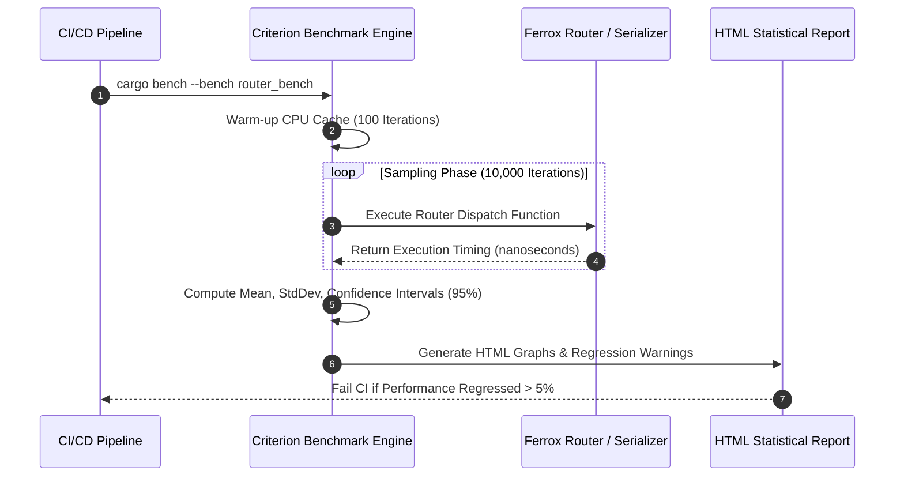

# Micro-Benchmarks, Criterion Suites & Comparative Metrics

The `benchmarks` performance module provides automated micro-benchmarking suites (via `Criterion.rs`), latency comparison metrics against standard Rust and Node.js frameworks, and throughput regression testing tools.

---

## 1. What It Is & Architectural Purpose

High-performance frameworks require continuous benchmarking to ensure new features, middleware layers, or dependency upgrades do not introduce performance regressions or memory allocation bloat.

The `benchmarks` suite provides automated performance testing for Ferrox components. It uses `Criterion.rs` to measure throughput (req/sec), execution latencies (ns/µs), and memory allocation overheads, outputting statistical comparison charts.

```
┌────────────────────────────────────────────────────────────────────────┐
│                        Ferrox Criterion Benchmarks                     │
├──────────────────────────────────┬─────────────────────────────────────┤
│  Micro-Benchmark Suites          │  Statistical Analysis Engine        │
│  • HTTP Router Dispatch (ns)     │  • Mean, Median, StdDev Analysis    │
│  • Serialization / Deserialization│  • Outlier & Regression Detection   │
└────────────────┬─────────────────┴──────────────────┬──────────────────┘
                 │ Benchmark Statistical Report
                 ▼
┌────────────────────────────────────────────────────────────────────────┐
│                        HTML Criterion Charts & Logs                    │
└────────────────────────────────────────────────────────────────────────┘
```

---

## 2. What It Does & Key Capabilities

- **High-Precision Timing**: Measures nano-second execution times using CPU cycle counters.
- **Statistical Regression Detection**: Identifies performance regressions between git commits automatically.
- **HTTP Transport Benchmarks**: Measures requests-per-second throughput across REST, gRPC, and WebSocket transports.
- **Memory Allocation Tracking**: Quantifies heap allocations per operation using custom allocators.

---

## 3. How It Works Under the Hood

### Criterion Statistical Benchmark Execution



---

## 4. Why It Was Designed This Way

| Metric | Basic Stopwatch Timing | Ferrox Criterion Suite |
| :--- | :--- | :--- |
| **Statistical Accuracy**| Affected by OS background noise and CPU frequency scaling. | Uses 95% confidence intervals and outlier rejection algorithms. |
| **Regression Prevention**| Manual testing misses minor 3% performance drops. | Automated CI build failures on any statistically significant regression. |
| **CPU Warmup** | Cold cache distorts first iteration results. | Automated cache warm-up phases isolate steady-state performance. |

---

## 5. Practical Usage Guide & Extended Code Examples

### 5.1 Writing Criterion Micro-Benchmarks

```rust
use criterion::{criterion_group, criterion_main, Criterion, BlackBox};
use ferrox_transports::router::RouterEngine;

pub fn bench_router_dispatch(c: &mut Criterion) {
    let router = RouterEngine::new_with_routes();

    c.bench_function("router_path_matching", |b| {
        b.iter(|| {
            // BlackBox prevents Rust compiler from optimizing away execution
            router.match_route(BlackBox("/api/v1/users/usr_999"))
        })
    });
}

criterion_group!(benches, bench_router_dispatch);
criterion_main!(benches);
```

---

## 6. Anti-Patterns: How NOT to Use It

> [!CAUTION]
> **Anti-Pattern 1: Compiler Optimization Elimination**
> Always wrap benchmark input variables in `criterion::BlackBox`. Omitting `BlackBox` allows the Rust compiler to optimize away un-used return values during compilation, producing fake 0ns timing results.

---

## 7. Pro-Tips & Best Practices

> [!TIP]
> **Pro-Tip 1: CI/CD Performance Thresholds**
> Run `cargo bench -- --save-baseline main` in your CI/CD pipeline to catch performance regressions automatically on every pull request.
