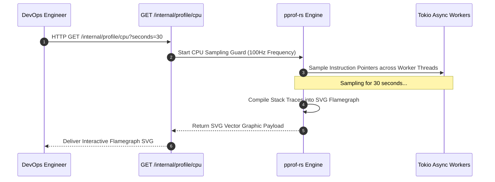

# CPU Profiling, Memory Leak Detection & Flamegraphs

The `profiling` performance module delivers CPU profiling, memory allocation tracking (`jemalloc`), flamegraph generation, and memory leak diagnostics for Rust microservices.

---

## 1. What It Is & Architectural Purpose

High-performance microservices require continuous profiling to identify CPU bottlenecks, lock contention, and hidden memory leaks before they degrade production SLAs. In Rust, diagnosing performance regressions requires low-overhead profiling utilities integrated directly into the binary.

The `profiling` module integrates `pprof-rs`, `jemallocator`, and OpenTelemetry profiling extensions. It allows developers to capture CPU flamegraphs and memory heap profiles dynamically on live production pods via specialized admin endpoints.

```
┌────────────────────────────────────────────────────────────────────────┐
│                        Ferrox Profiling Kernel                         │
├──────────────────────────────────┬─────────────────────────────────────┤
│  CPU Flamegraph Profiler (pprof) │  Jemalloc Memory Heap Profiler      │
│  • Low 1% Overhead CPU Sampling  │  • Active Memory Allocation Tracking│
│  • SVG Flamegraph Generator      │  • Heap Dump Analysis Engine        │
└────────────────┬─────────────────┴──────────────────┬──────────────────┘
                 │ Diagnostic SVG / Heap Profile
                 ▼
┌────────────────────────────────────────────────────────────────────────┐
│                        Admin Diagnostic Endpoint                       │
└────────────────────────────────────────────────────────────────────────┘
```

---

## 2. What It Does & Key Capabilities

- **On-Demand CPU Flamegraphs**: Captures 100Hz CPU sample profiles and outputs interactive SVG flamegraph files.
- **Jemalloc Heap Profiling**: Monitors active memory allocations and outputs heap dumps (`jeprof`) to identify memory leaks.
- **Async Tokio Task Profiling**: Inspects Tokio async runtime worker threads to detect long-running blocking tasks.
- **Low Overhead Sampling**: Introduces < 1% CPU overhead during active profiling sessions, safe for production environments.

---

## 3. How It Works Under the Hood

### Live CPU Flamegraph Profiling Sequence



---

## 4. Why It Was Designed This Way

| Feature | External OS Profilers (perf / gdb) | Ferrox Embedded Profiler |
| :--- | :--- | :--- |
| **K8s Environment**| Requires root privileges and installing perf tools in containers. | Embedded in application binary. Triggered via secure API endpoints. |
| **Async Context** | OS profilers lose async task execution context across awaits. | `pprof-rs` preserves Tokio async stack trace spans. |
| **Production Use**| High overhead halts live production pods. | Low 1% sampling overhead designed for production execution. |

---

## 5. Practical Usage Guide & Extended Code Examples

### 5.1 Capturing CPU Flamegraph Programmatically

```rust
use ferrox_performance::profiling::{ProfileGuard, FlamegraphOptions};
use std::fs::File;

pub async fn capture_cpu_flamegraph(duration_secs: u64, output_path: &str) -> Result<(), ProfileError> {
    let guard = ProfileGuard::new(100)?; // 100Hz sampling rate

    tokio::time::sleep(tokio::time::Duration::from_secs(duration_secs)).await;

    let report = guard.report().build()?;
    let mut file = File::create(output_path)?;

    report.flamegraph(&mut file)?;
    println!("Flamegraph saved to {}", output_path);

    Ok(())
}
```

---

## 6. Anti-Patterns: How NOT to Use It

> [!CAUTION]
> **Anti-Pattern 1: High Sampling Frequencies in Production**
> Avoid setting CPU sampling frequencies above 1,000Hz in production environments. Excessive sampling rates introduce CPU overhead and distort benchmark results.

---

## 7. Pro-Tips & Best Practices

> [!TIP]
> **Pro-Tip 1: Jemalloc Memory Profiling**
> Enable `jemallocator` in `Cargo.toml` (`features = ["profiling"]`) to analyze heap allocations using `jeprof --show_bytes --pdf`.
