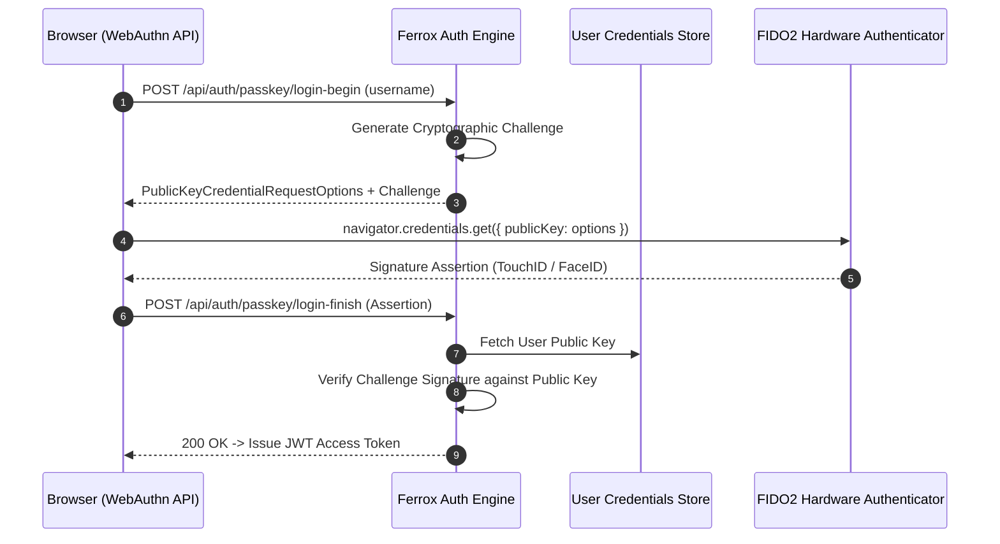

# Advanced Authentication, OAuth2, OpenID Connect & WebAuthn / Passkeys

The `advanced-auth` security module delivers multi-strategy identity management in Rust: OAuth2 authorization code flows, OpenID Connect (OIDC) single sign-on (SSO), WebAuthn / FIDO2 Passkey passwordless authentication, and multi-factor authentication (MFA / TOTP).

---

## 1. What It Is & Architectural Purpose

Modern enterprise security standards demand supporting modern identity protocols: Google/GitHub OAuth2 login, Okta/Keycloak OpenID Connect SSO, hardware Passkeys (WebAuthn / YubiKey), and TOTP authenticator apps. Building separate OAuth2 parsers and WebAuthn byte decoders for every microservice introduces severe security risks.

`advanced-auth` provides a unified authentication engine. It abstracts OAuth2 handshake flows, verifies OIDC identity tokens, and processes WebAuthn FIDO2 attestation payloads in pure Rust.

```
┌────────────────────────────────────────────────────────────────────────┐
│                        Ferrox AdvancedAuth Engine                      │
├──────────────────────────────────┬─────────────────────────────────────┤
│  OAuth2 / OIDC SSO Client        │  WebAuthn Passkey Engine            │
│  • PKCE Code Exchange            │  • FIDO2 Attestation Verifier       │
│  • JWKS Identity Verification    │  • Hardware YubiKey / Biometric     │
└────────────────┬─────────────────┴──────────────────┬──────────────────┘
                 │ Unified User Authentication
                 ▼
┌────────────────────────────────────────────────────────────────────────┐
│                        Ferrox Session & JWT Guard                      │
└────────────────────────────────────────────────────────────────────────┘
```

---

## 2. What It Does & Key Capabilities

- **OAuth2 with PKCE**: Supports OAuth2 authorization code flow with Proof Key for Code Exchange (PKCE) for mobile and web clients.
- **OpenID Connect (OIDC) SSO**: Verifies OIDC ID tokens from Okta, Keycloak, Auth0, Google, and Azure AD.
- **WebAuthn Passkeys (FIDO2)**: Hardware-backed passwordless login using TouchID, FaceID, Windows Hello, and YubiKeys.
- **TOTP Multi-Factor Authentication**: Generates dynamic TOTP QR code secrets (Google Authenticator / Authy) and verifies 6-digit codes.

---

## 3. How It Works Under the Hood

### WebAuthn Passkey Authentication Sequence



---

## 4. Why It Was Designed This Way

| Feature | Password-Only Auth | Ferrox AdvancedAuth Engine |
| :--- | :--- | :--- |
| **Credential Phishing**| High risk. Passwords can be stolen via phishing sites. | WebAuthn Passkeys are domain-bound and immune to phishing. |
| **Enterprise SSO** | Hand-rolled OAuth2 parsing breaks when providers update endpoints. | Standard OIDC auto-discovery resolves authorization & JWKS URIs automatically. |
| **Security Compliance**| Does not meet FedRAMP / SOC2 MFA mandates. | Hardware FIDO2 + TOTP MFA satisfies SOC2 & FedRAMP controls. |

---

## 5. Practical Usage Guide & Extended Code Examples

### 5.1 OIDC Token Verification Example

```rust
use ferrox_security::advanced_auth::{OidcClient, OidcConfig};

pub async fn handle_sso_callback(
    auth_code: &str,
    pkce_verifier: &str,
) -> Result<UserIdentity, AuthError> {
    let oidc = OidcClient::new(OidcConfig {
        issuer_url: "https://auth.company.com/realms/master".to_string(),
        client_id: "ferrox_app".to_string(),
        client_secret: Some("secret_key".to_string()),
    }).await?;

    // Exchange authorization code for OIDC ID Token & Access Token
    let token_response = oidc.exchange_code(auth_code, pkce_verifier).await?;

    // Verify ID Token signature and extract claims
    let identity = oidc.verify_id_token(&token_response.id_token).await?;

    Ok(UserIdentity {
        id: identity.subject,
        email: identity.email,
        name: identity.name,
    })
}
```

---

## 6. Anti-Patterns: How NOT to Use It

> [!CAUTION]
> **Anti-Pattern 1: Disabling PKCE in OAuth2 Flows**
> Never disable PKCE (`Proof Key for Code Exchange`) when initiating OAuth2 authorization flows. PKCE protects authorization codes from being intercepted by malicious local desktop/mobile applications.

---

## 7. Pro-Tips & Best Practices

> [!TIP]
> **Pro-Tip 1: WebAuthn Challenge Expiration**
> Always set short expiration windows (e.g., 60 seconds) on WebAuthn challenges stored in Redis to prevent challenge replay attacks.
