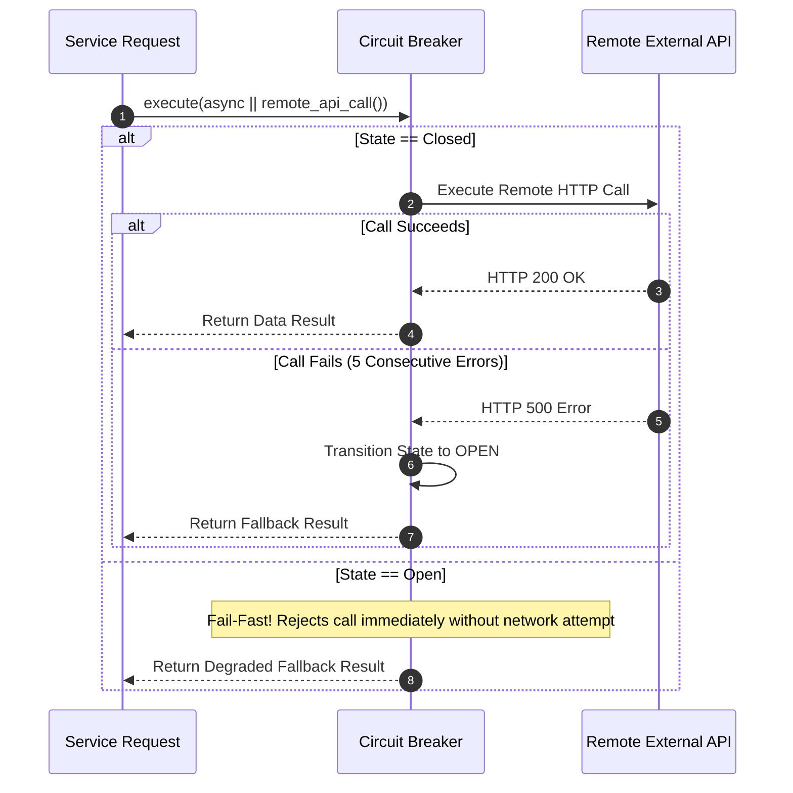

# Circuit Breaker State Machine & Microservice Resilience

The `circuit-breaker` security module implements fault tolerance for Rust microservices (`ferrox-circuit-breaker`). It features a finite state machine (`Closed`, `Open`, `HalfOpen`), failure threshold monitoring, automatic recovery probing, and fallback execution pipelines.

---

## 1. What It Is & Architectural Purpose

When remote external HTTP APIs, microservices, or database nodes slow down or fail, upstream microservices calling them synchronously can experience cascading thread starvation: thread pools saturate waiting for network socket timeouts, cascading failures across the entire cluster.

The `CircuitBreaker` in Ferrox isolates failing external dependencies. It monitors failure ratios, opens the circuit breaker to fail fast without waiting for network timeouts when errors exceed configured thresholds, and probes recovery automatically.

```
┌────────────────────────────────────────────────────────────────────────┐
│                   Circuit Breaker State Machine                        │
├────────────────────────────────────────────────────────────────────────┤
│                                                                        │
│      [ CLOSED ] ──(Failures > Threshold)──> [ OPEN ]                   │
│          ▲                                    │                        │
│          │                               (Timeout Expired)             │
│    (Probes Succeed)                           │                        │
│          │                                    ▼                        │
│          └─────────────── [ HALF-OPEN ] <─────┘                        │
│                                                                        │
└────────────────────────────────────────────────────────────────────────┘
```

---

## 2. What It Does & Key Capabilities

- **Finite State Machine**: Toggles between `Closed` (normal routing), `Open` (failing, rejects calls immediately), and `HalfOpen` (probing recovery).
- **Failure Threshold Evaluation**: Calculates error rates over configurable sliding time windows.
- **Immediate Fail-Fast Execution**: Rejects calls in 0ms when `Open`, preventing network socket pool depletion.
- **Fallback Result Execution**: Returns pre-cached data or degraded fallback responses when the circuit is `Open`.

---

## 3. How It Works Under the Hood

### Circuit Breaker State Transition Sequence



---

## 4. Why It Was Designed This Way

| Feature | Direct Unprotected Network Calls | Ferrox Circuit Breaker |
| :--- | :--- | :--- |
| **Cascading Failures**| Dying third-party payment API hangs all web worker threads. | Circuit Breaker opens in 0ms, protecting thread pools. |
| **Recovery** | Manual pod restarts required to recover after network outage. | `HalfOpen` state probes service recovery automatically. |
| **User Experience** | Users wait 30 seconds for network timeout error pages. | Users receive instant fallback responses in 1ms. |

---

## 5. Practical Usage Guide & Extended Code Examples

### 5.1 Protecting Remote API Calls

```rust
use ferrox_circuit_breaker::{CircuitBreaker, BreakerOptions};

pub async fn call_external_recommendation_engine(
    user_id: &str,
    breaker: &CircuitBreaker,
) -> Result<Vec<String>, ServiceError> {
    let result = breaker.execute(
        // Primary Async Task
        move || async move {
            fetch_recommendations_over_http(user_id).await
        },
        // Fallback Task when Circuit is OPEN or fails
        move |err| async move {
            println!("Circuit Breaker active ({:?}). Returning default items.", err);
            Ok(vec!["item_default_1".to_string(), "item_default_2".to_string()])
        }
    ).await?;

    Ok(result)
}
```

---

## 6. Anti-Patterns: How NOT to Use It

> [!CAUTION]
> **Anti-Pattern 1: Wrapping Local Memory Operations in Circuit Breakers**
> Do not place local in-memory code or CPU math functions inside circuit breakers. Circuit breakers are designed specifically for network I/O boundaries (HTTP, gRPC, DB, Redis).

---

## 7. Pro-Tips & Best Practices

> [!TIP]
> **Pro-Tip 1: Prometheus Metric Monitoring**
> Export circuit breaker state transitions (`closed=0`, `open=1`, `half_open=2`) to Prometheus metrics to alert ops teams when critical dependencies enter `OPEN` state.
