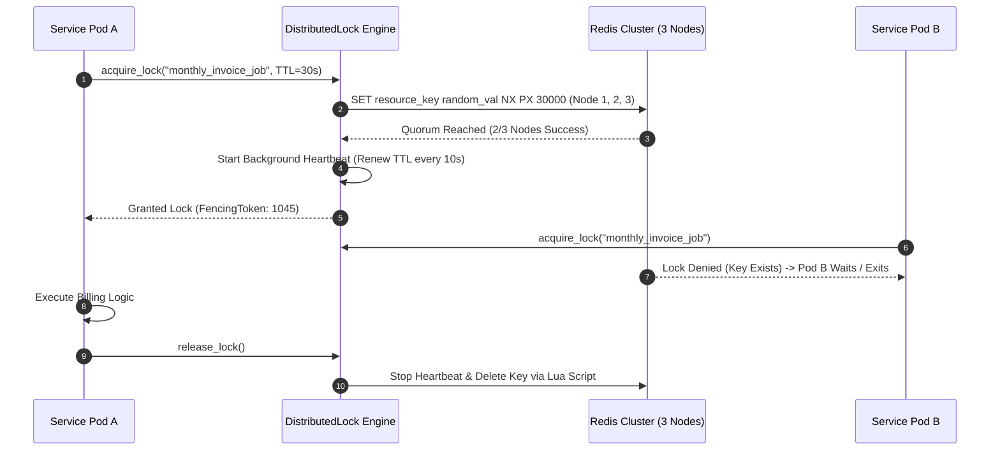

# Distributed Locks, Redlock Algorithm & Synchronization

The `distributed-locks` module provides distributed mutual exclusion lock mechanisms (`ferrox-sync` / Redis Redlock algorithm). It ensures that across a cluster of microservice instances, only one worker thread executes a critical section at any given millisecond.

---

## 1. What It Is & Architectural Purpose

In a distributed microservice cluster running 50 container pods, background task execution (such as generating monthly billing invoices, processing inventory deductions, or running cron tasks) can lead to race conditions if multiple pods run the same job concurrently. Local process thread locks (`tokio::sync::Mutex`) cannot synchronize state across separate container instances.

The `DistributedLock` engine in Ferrox implements the Redis Redlock algorithm and Postgres advisory locks. It guarantees strict mutual exclusion across distributed clusters with automated lock auto-renewal and deadlocks protection.

```
┌────────────────────────────────────────────────────────────────────────┐
│                      Ferrox DistributedLock Engine                     │
├────────────────────────────────────────────────────────────────────────┤
│  • Redlock Algorithm Multi-Node Consensus                              │
│  • Automatic Lock Heartbeat Lease Renewal                              │
│  • Fencing Token Generation (Anti-Stale Writer Shield)                 │
└──────────────────────────────────┬─────────────────────────────────────┘
                                   │ Distributed Consensus Protocol
            ┌──────────────────────┼──────────────────────┐
            ▼                      ▼                      ▼
┌──────────────────────┐┌──────────────────────┐┌──────────────────────┐
│ Redis Node 1         ││ Redis Node 2         ││ Redis Node 3         │
└──────────────────────┘└──────────────────────┘└──────────────────────┘
```

---

## 2. What It Does & Key Capabilities

- **Redlock Consensus Protocol**: Acquires locks across N independent Redis nodes to prevent single-point-of-failure lock releases.
- **Automated Lease Renewal (Heartbeat)**: Automatically extends lock lease expiration while the critical section is actively executing.
- **Fencing Token Generation**: Assigns monotonically increasing fencing tokens to detect and drop stale concurrent writers.
- **Postgres Advisory Lock Fallback**: Uses database-level advisory locks (`pg_advisory_xact_lock`) when Redis is unavailable.

---

## 3. How It Works Under the Hood

### Redlock Acquisition & Auto-Renewal Mechanics



---

## 4. Why It Was Designed This Way

| Feature | Single Redis Node Lock | Ferrox Redlock Distributed Engine |
| :--- | :--- | :--- |
| **Fault Tolerance** | Master node crash before replication releases lock prematurely. | Redlock requires N/2 + 1 majority quorum across independent nodes. |
| **Long Execution** | Fixed TTL lock expires mid-task, allowing duplicate pod execution. | Automatic background heartbeat extends lock TTL while task runs. |
| **Stale Writes** | Delayed GC pause pod writes corrupt state after losing lock. | Fencing tokens allow downstream storage to reject stale writers. |

---

## 5. Practical Usage Guide & Extended Code Examples

### 5.1 Acquiring Distributed Lock with Guard Wrapper

```rust
use ferrox_security::locks::{DistributedLockManager, LockOptions};

pub async fn execute_critical_batch_job(
    lock_manager: &DistributedLockManager,
) -> Result<(), JobError> {
    let lock_key = "job:monthly_account_billing";

    // Attempt to acquire distributed lock with 30s TTL and auto-renewal
    let lock_guard = lock_manager
        .acquire(lock_key, LockOptions::default().ttl_seconds(30).auto_renew(true))
        .await?;

    match lock_guard {
        Some(guard) => {
            println!("Acquired distributed lock. Fencing token: {}", guard.fencing_token());

            // Execute critical section exclusively
            run_billing_calculation().await?;

            // Lock is automatically released when `guard` is dropped
            Ok(())
        }
        None => {
            println!("Another service instance is currently holding the lock. Skipping execution.");
            Ok(())
        }
    }
}
```

---

## 6. Anti-Patterns: How NOT to Use It

> [!CAUTION]
> **Anti-Pattern 1: Omitting Auto-Renewal on Long Tasks**
> Never set a short fixed lock TTL (e.g., 5 seconds) for a task that takes 20 seconds without enabling `auto_renew`. The lock will expire mid-task, allowing another node to enter the critical section.

---

## 7. Pro-Tips & Best Practices

> [!TIP]
> **Pro-Tip 1: Lua Script Deletion**
> Always use atomic Lua scripts when releasing locks to ensure keys are deleted *only* if the value still matches the original instance identifier.
