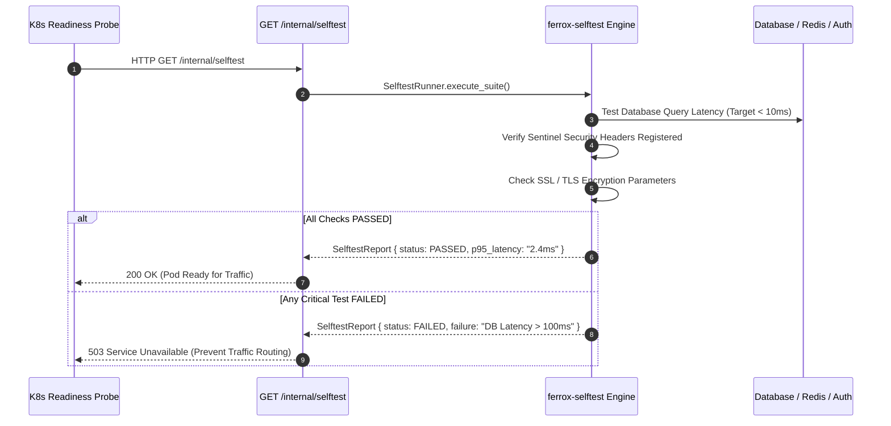

# Self-Test Security Suite, OWASP Scans & Latency Runner

The `ferrox-selftest` crate delivers self-diagnostic security compliance checks, OWASP WSTG compliance verification, p50/p95/p99 latency benchmark execution, and automated deployment readiness audits for Rust microservices.

---

## 1. What It Is & Architectural Purpose

Enterprise applications deployed to Kubernetes or cloud clusters need to verify that security posture, database connections, cache readiness, and response latencies satisfy SLA constraints before receiving live production traffic.

`ferrox-selftest` embeds an automated self-diagnostic runner inside your microservice binary. It runs OWASP security audits, database latency benchmarks, and dependency sanity checks during application startup or when probed via specialized CLI commands.

```
┌────────────────────────────────────────────────────────────────────────┐
│                        ferrox-selftest Engine                          │
├──────────────────────────────────┬─────────────────────────────────────┤
│  OWASP Security Compliance Audit │  Latency Benchmark Engine           │
│  • Security Header Bouncer Checks│  • p50 / p95 / p99 Latency Metrics  │
│  • TLS & Secrets Encryption Scan │  • DB & Cache Query Benchmarks      │
└────────────────┬─────────────────┴──────────────────┬──────────────────┘
                 │ Diagnostic Result Report
                 ▼
┌────────────────────────────────────────────────────────────────────────┐
│                        Kubernetes Readiness Probe                      │
└────────────────────────────────────────────────────────────────────────┘
```

---

## 2. What It Does & Key Capabilities

- **OWASP WSTG Security Audits**: Verifies security header configurations (CSP, HSTS, X-Frame-Options) and CORS origin matchers.
- **Latency p50/p95/p99 Benchmarking**: Measures internal database query execution latencies and Redis cache get/set roundtrips.
- **Dependency Sanity Verification**: Tests database schema version compatibility, Kafka broker reachability, and S3 credentials.
- **Kubernetes Startup & Readiness Integration**: Returns structured diagnostic payloads formatted for K8s `/healthz` and `/readyz` probes.

---

## 3. How It Works Under the Hood

### Self-Test Diagnostic Execution Sequence



---

## 4. Why It Was Designed This Way

| Feature | External Manual Testing | Ferrox Self-Test Engine |
| :--- | :--- | :--- |
| **Automation** | Requires manual penetration tests before every release. | Runs automated OWASP & latency audits directly inside application binary. |
| **Fail-Safe** | Misconfigured pods start serving live user requests silently. | K8s readiness probes fail fast if self-tests fail, blocking deployment. |
| **Performance** | Unknown p95 latency until production traffic hits. | Built-in p50/p95/p99 latency benchmarks verify SLAs at startup. |

---

## 5. Practical Usage Guide & Extended Code Examples

### 5.1 Running Self-Tests Programmatically

```rust
use ferrox_selftest::{SelftestRunner, SelftestSuite};

pub async fn run_startup_diagnostics() -> Result<(), String> {
    let runner = SelftestRunner::builder()
        .with_suite(SelftestSuite::OwaspSecurity)
        .with_suite(SelftestSuite::DatabaseLatency)
        .with_suite(SelftestSuite::CacheReachability)
        .build();

    let report = runner.run().await;

    if report.is_success() {
        println!("Self-Test Passed! P95 Latency: {:?}", report.p95_latency());
        Ok(())
    } else {
        Err(format!("Self-Test Diagnostics Failed: {:?}", report.failures()))
    }
}
```

---

## 6. Anti-Patterns: How NOT to Use It

> [!CAUTION]
> **Anti-Pattern 1: Disabling Self-Tests in Staging/Production**
> Never bypass self-test runners during deployment pipelines. Running self-tests guarantees that invalid environment secrets or unreachable database pools are caught before traffic is routed.

---

## 7. Pro-Tips & Best Practices

> [!TIP]
> **Pro-Tip 1: CLI Integration**
> Run `ferrox selftest --suite=security` directly from your CI/CD pipeline to block pull-requests that weaken framework security settings.
