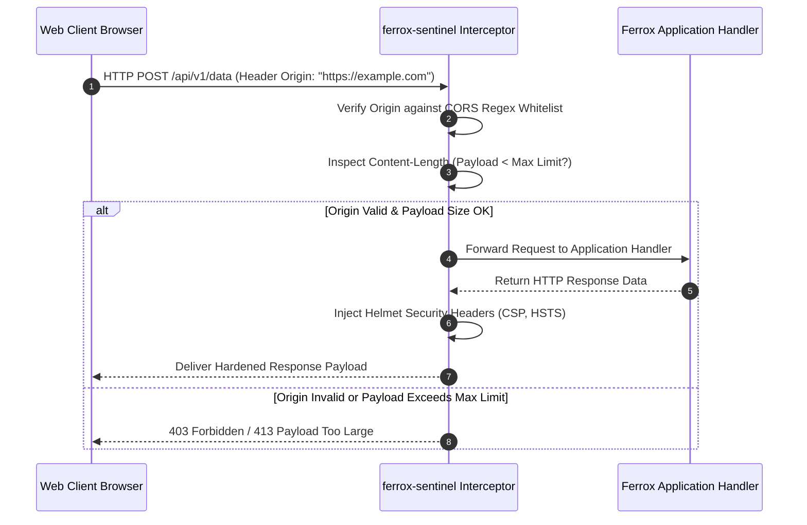

# Ferrox Sentinel Edge Shield, CSP Directives & Payload Bouncer

The `ferrox-sentinel` crate is the edge security bouncer for the Ferrox framework. It delivers automated HTTP security headers (Helmet CSP, HSTS, X-Frame-Options), CORS origin regex validation, payload size bouncers, and malicious request parameter sanitization.

---

## 1. What It Is & Architectural Purpose

Web applications are exposed to edge security threats: Cross-Site Scripting (XSS), Clickjacking, Cross-Site Request Forgery (CSRF), MIME-sniffing exploits, and payload inflation DoS attacks. Leaving security header configuration to manual web server rules creates vulnerabilities across environments.

`ferrox-sentinel` acts as an automated security shield. Intercepting requests at the outer layer of the transport router, it validates CORS origins, sanitizes headers, enforces strict Content Security Policy (CSP) directives, and bounces oversized payloads before they reach business logic.

```
┌────────────────────────────────────────────────────────────────────────┐
│                        ferrox-sentinel Edge Shield                     │
├──────────────────────────────────┬─────────────────────────────────────┤
│  Strict Security Headers         │  CORS & Payload Bouncer             │
│  • CSP (Content-Security-Policy) │  • Dynamic Regex Origin Matcher     │
│  • HSTS, X-Frame-Options, XSS    │  • Max Payload Size Enforcement     │
└────────────────┬─────────────────┴──────────────────┬──────────────────┘
                 │ Clean, Hardened Transport Context
                 ▼
┌────────────────────────────────────────────────────────────────────────┐
│                        Ferrox Application Router                       │
└────────────────────────────────────────────────────────────────────────┘
```

---

## 2. What It Does & Key Capabilities

- **Helmet Security Headers**: Automatically injects `Content-Security-Policy`, `Strict-Transport-Security`, `X-Content-Type-Options: nosniff`, and `X-Frame-Options: DENY`.
- **Dynamic CORS Origin Matcher**: Evaluates incoming `Origin` headers against dynamic regex patterns and multi-domain wildcard rules.
- **Payload Size Bouncer**: Intercepts HTTP request streams and rejects payloads exceeding configured size thresholds (e.g., max 2MB) before buffering into memory.
- **Path & Parameter Sanitizer**: Strips null-byte injections, directory traversal attempts, and malformed URI encodings.

---

## 3. How It Works Under the Hood

### Sentinel Edge Interception Sequence



---

## 4. Why It Was Designed This Way

| Feature | Manual Server Header Config | ferrox-sentinel Edge Shield |
| :--- | :--- | :--- |
| **Consistency** | Web headers omitted when running apps in local Docker pods. | Framework-level guarantee. Headers injected in all environments. |
| **DoS Protection** | Large 100MB payload buffered in RAM before throwing error. | Sentinel bounces oversized streams at the transport socket level. |
| **CORS Security** | Wildcard `Access-Control-Allow-Origin: *` with credentials bug. | Strict origin regex validation supporting credentialed CORS. |

---

## 5. Practical Usage Guide & Extended Code Examples

### 5.1 Configuring Sentinel Middleware in Rust

```rust
use ferrox_sentinel::{SentinelEngine, SentinelOptions, CspDirective};

pub fn configure_security_shield() -> SentinelEngine {
    SentinelEngine::new(SentinelOptions {
        enable_hsts: true,
        hsts_max_age_seconds: 31536000, // 1 Year
        frame_options: "DENY".to_string(),
        max_body_bytes: 2 * 1024 * 1024, // 2MB Max Payload
        cors_allowed_origins: vec![
            r"^https://.*\.mycompany\.com$".to_string(),
            r"^https://mycompany\.com$".to_string(),
        ],
        csp_directives: vec![
            CspDirective::default_src(vec!["'self'"]),
            CspDirective::script_src(vec!["'self'", "'wasm-unsafe-eval'"]),
            CspDirective::style_src(vec!["'self'", "'unsafe-inline'"]),
        ],
    })
}
```

---

## 6. Anti-Patterns: How NOT to Use It

> [!CAUTION]
> **Anti-Pattern 1: Permissive Content Security Policy**
> Avoid setting `script-src: '*'` or `default-src: '*'` in production CSP rules. Permissive CSP directives defeat XSS protection shields.

---

## 7. Pro-Tips & Best Practices

> [!TIP]
> **Pro-Tip 1: CSP Report-Only Mode**
> Use `csp_report_only: true` during initial production deployments to collect CSP violation reports without blocking legitimate web application assets.
