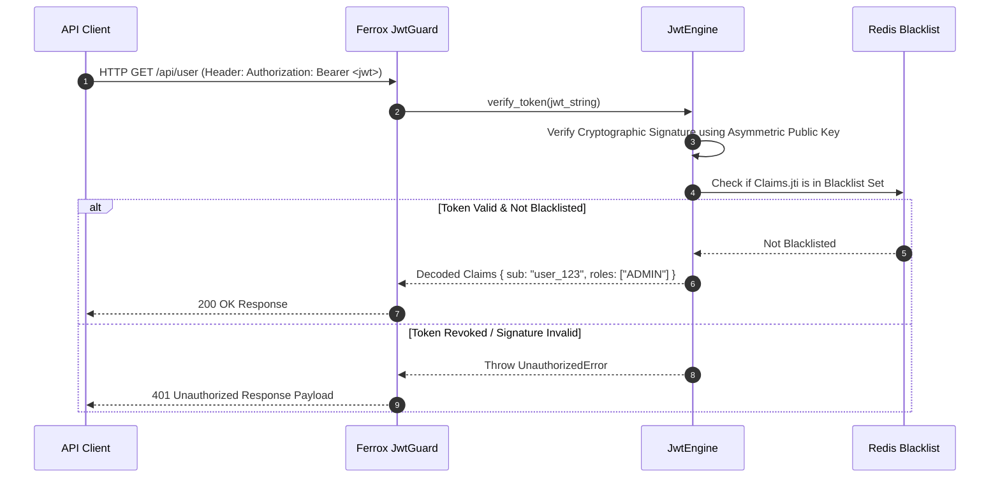

# JWT Authentication Engine, RSA/Ed25519 Signing & Revocation

The `jwt` security module provides JSON Web Token (JWT) issuing, RSA-256 / Ed25519 cryptographic verification, automated key rotation, refresh token rotation with reuse detection, and distributed token blacklisting in Rust.

---

## 1. What It Is & Architectural Purpose

Stateless API authentication across microservices relies on JSON Web Tokens. However, insecure JWT setups introduce severe vulnerabilities: using weak HMAC-HS256 secrets hardcoded in environment files, failing to handle key rotation, or being unable to revoke compromised tokens prior to expiration.

The `JwtEngine` in Ferrox provides enterprise JWT authentication. It supports asymmetric cryptography (RS256 / Ed25519), JWKS (JSON Web Key Set) remote verification, Redis token blacklisting, and automatic refresh token rotation.

```
┌────────────────────────────────────────────────────────────────────────┐
│                          Ferrox JwtEngine                              │
├──────────────────────────────────┬─────────────────────────────────────┤
│  Asymmetric Token Signing        │  Token Revocation & Blacklist       │
│  • Ed25519 / RS256 Private Keys  │  • Redis JTI Blacklist Cache        │
│  • JWKS Public Key Endpoint      │  • Refresh Token Reuse Detector     │
└────────────────┬─────────────────┴──────────────────┬──────────────────┘
                 │ Signed JWT Claims
                 ▼
┌────────────────────────────────────────────────────────────────────────┐
│                        Microservice Bearer Auth Guard                  │
└────────────────────────────────────────────────────────────────────────┘
```

---

## 2. What It Does & Key Capabilities

- **Asymmetric Signing Support**: Issues and verifies tokens using RS256 (RSA 2048/4048) or Ed25519 (Edwards-curve Digital Signature Algorithm).
- **Automated JWKS Key Rotation**: Serves and consumes standard `.well-known/jwks.json` endpoints with zero-downtime key rotation.
- **Refresh Token Reuse Detection**: Implements refresh token family tracking that automatically revokes all tokens if a revoked refresh token is reused.
- **Distributed Token Blacklist**: Revokes specific token IDs (`jti`) instantly in Redis on logout or security events.

---

## 3. How It Works Under the Hood

### Asymmetric JWT Verification Sequence



---

## 4. Why It Was Designed This Way

| Feature | Symmetric HS256 JWT Setup | Ferrox Asymmetric JwtEngine |
| :--- | :--- | :--- |
| **Secret Sharing** | Symmetric secret must be shared across all microservices. | Microservices verify tokens using public keys only (Private key isolated). |
| **Revocation** | Unable to revoke tokens before expiration. | Real-time JTI revocation list checked in Redis memory (0.1ms). |
| **Reuse Attack** | Re-using old refresh token goes unnoticed. | Family tracking revokes entire token chain if reuse is detected. |

---

## 5. Practical Usage Guide & Extended Code Examples

### 5.1 Issuing and Verifying Asymmetric JWT Tokens

```rust
use ferrox_security::jwt::{JwtEngine, Claims, KeyPair};

pub fn demonstrate_jwt_issuance() -> Result<(), JwtError> {
    // Generate or load Ed25519 Key Pair
    let key_pair = KeyPair::generate_ed25519()?;
    let engine = JwtEngine::new(key_pair);

    let claims = Claims::builder()
        .subject("usr_999")
        .issuer("auth-service.company.com")
        .audience("api-gateway")
        .expiration_in_seconds(3600) // 1 Hour TTL
        .claim("role", "ADMIN")
        .build()?;

    // Sign JWT using Ed25519 Private Key
    let token_string = engine.sign(&claims)?;
    println!("Issued JWT: {}", token_string);

    // Verify JWT using Public Key
    let decoded_claims = engine.verify(&token_string)?;
    assert_eq!(decoded_claims.subject, "usr_999");

    Ok(())
}
```

---

## 6. Anti-Patterns: How NOT to Use It

> [!CAUTION]
> **Anti-Pattern 1: Storing Sensitive PII inside Claims**
> Never store sensitive unencrypted data (passwords, credit card numbers, SSNs) inside JWT payload claims. JWT payloads are base64-encoded and readable by anyone.

---

## 7. Pro-Tips & Best Practices

> [!TIP]
> **Pro-Tip 1: Short Access Token Lifetimes**
> Keep access token expiration short (e.g., 15 minutes) and rely on refresh token rotation to minimize impact if an access token is intercepted.
