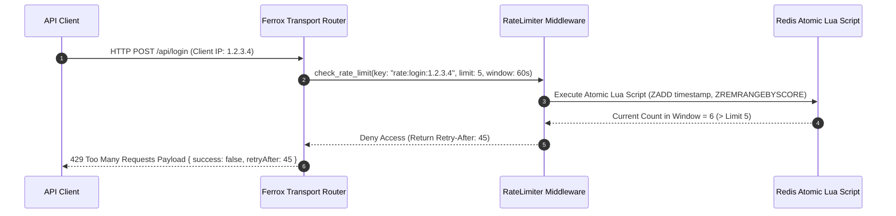

# Rate Limiting Engine, Leaky Bucket & Sliding Window Log

The `rate-limiting` security module delivers distributed rate-limiting and traffic shaping for Rust web applications (`ferrox-rate-limiter`). It features Sliding Window Log, Token Bucket, and Leaky Bucket algorithms backed by atomic Redis operations.

---

## 1. What It Is & Architectural Purpose

Web applications and public API gateways are subject to denial-of-service (DoS) floods, credential stuffing attacks, web scraping bots, and brute-force password cracking attempts. Without rate limiting, malicious traffic exhausts server CPU cores and database connections.

The `RateLimiter` in Ferrox controls incoming traffic velocity. It tracks request frequencies per IP address, user ID, or API key using high-performance Redis Lua scripts, returning `429 Too Many Requests` when limits are exceeded.

```
┌────────────────────────────────────────────────────────────────────────┐
│                        Ferrox RateLimiter Engine                       │
├──────────────────────────────────┬─────────────────────────────────────┤
│  Atomic Redis Lua Scripting      │  Multi-Algorithm Rate Limiters      │
│  • 0.1ms Atomic Counter Check    │  • Sliding Window Log Algorithm     │
│  • Automatic Expiration TTL      │  • Token Bucket & Leaky Bucket      │
└────────────────┬─────────────────┴──────────────────┬──────────────────┘
                 │ Rate Evaluation
                 ▼
┌────────────────────────────────────────────────────────────────────────┐
│                        HTTP API Response Pipeline                      │
└────────────────────────────────────────────────────────────────────────┘
```

---

## 2. What It Does & Key Capabilities

- **Sliding Window Log Algorithm**: Eliminates burst boundary vulnerabilities found in fixed-window limiters.
- **Token Bucket Traffic Shaper**: Allows controlled bursts while maintaining strict steady-state throughput limits.
- **IP & User Identity Extractor**: Rate limits based on client IP (`x-forwarded-for`), JWT `user_id`, or API key headers.
- **Automated HTTP Header Emission**: Emits standard rate-limiting headers (`RateLimit-Limit`, `RateLimit-Remaining`, `RateLimit-Reset`).

---

## 3. How It Works Under the Hood

### Sliding Window Rate Evaluation Sequence



---

## 4. Why It Was Designed This Way

| Feature | Fixed Window Algorithm | Ferrox Sliding Window Log |
| :--- | :--- | :--- |
| **Burst Vulnerability**| 2x limit requests can burst at boundary minutes (e.g. 11:59:59 & 12:00:01). | Smooth sliding time window eliminates boundary burst exploits. |
| **Atomic Concurrency** | Race conditions allow extra requests in multi-threaded setups. | Single atomic Redis Lua script guarantees thread-safe counters. |
| **Headers** | No standard headers emitted. | Full compliance with IETF `RateLimit-*` header standards. |

---

## 5. Practical Usage Guide & Extended Code Examples

### 5.1 Applying Rate Limiting to Endpoints

```rust
use ferrox_rate_limiter::{RateLimiter, RateLimitConfig, Algorithm};

pub async fn protect_login_endpoint(
    client_ip: &str,
    limiter: &RateLimiter,
) -> Result<(), RateLimitError> {
    let key = format!("ratelimit:login:{}", client_ip);

    // Limit to 5 requests per 60 seconds per IP address
    let decision = limiter.evaluate(&key, RateLimitConfig {
        limit: 5,
        window_seconds: 60,
        algorithm: Algorithm::SlidingWindowLog,
    }).await?;

    if !decision.is_allowed {
        return Err(RateLimitError::TooManyRequests {
            retry_after_seconds: decision.retry_after,
        });
    }

    Ok(())
}
```

---

## 6. Anti-Patterns: How NOT to Use It

> [!CAUTION]
> **Anti-Pattern 1: Trusting Spoofable Headers for Client IP**
> Avoid blindly using `req.headers["x-forwarded-for"]` without validating reverse proxy IP whitelist rules. Attackers can forge IP header values to bypass IP rate limiters.

---

## 7. Pro-Tips & Best Practices

> [!TIP]
> **Pro-Tip 1: Tiered Rate Limiting**
> Configure higher rate limits for authenticated premium users (`10,000 req/min`) versus unauthenticated guest traffic (`60 req/min`).
