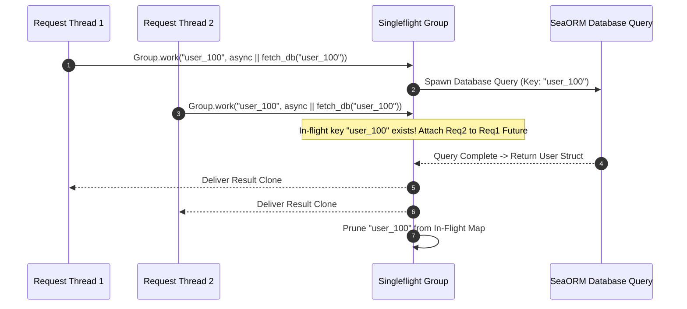

# Singleflight Request Deduplication & Cache Stampede Shield

The `singleflight` security module delivers lock-free, concurrent request deduplication for Rust microservices (`ferrox-singleflight`). It prevents thundering herd cache stampedes by executing concurrent duplicate work items exactly once.

---

## 1. What It Is & Architectural Purpose

When a popular cached database key expires (or a high-traffic endpoint experiences a surge of 1,000 simultaneous user requests), all 1,000 incoming requests miss the cache at the exact same millisecond and issue 1,000 identical SQL database queries simultaneously. This phenomenon, known as a **Cache Stampede** or **Thundering Herd**, spikes database CPU usage to 100% and crashes application pools.

`ferrox-singleflight` provides a lightweight, lock-free request deduplicator. When multiple concurrent threads request the exact same key (`"user_profile_100"`), only the first thread executes the underlying async work function. Subsequent threads wait for the first promise to settle and receive a shared clone of the result.

```
┌────────────────────────────────────────────────────────────────────────┐
│                      ferrox-singleflight Engine                        │
├────────────────────────────────────────────────────────────────────────┤
│  100 Concurrent Requests for Key ("user_profile_100")                  │
│    │                                                                   │
│    ├── Request #1  ---> Spawns Underlying Async Query Execution       │
│    └── Requests #2..100 -> Join In-Flight Shared Futures Map           │
└──────────────────────────────────┬─────────────────────────────────────┘
                                   │ Single Database Read Execution
                                   ▼
┌────────────────────────────────────────────────────────────────────────┐
│                        Database / Remote API Endpoint                  │
└────────────────────────────────────────────────────────────────────────┘
```

---

## 2. What It Does & Key Capabilities

- **Thundering Herd Shield**: Reduces N simultaneous identical query requests into a single database or remote API call.
- **Lock-Free Arc / Atomic Synchronization**: Implemented using lock-free Tokio futures and atomic channel sharing for 0ms overhead.
- **Shared Error Propagation**: If the primary execution returns an error, all waiting requests receive an identical error result clone.
- **Automatic Cleanup**: Automatically removes key entries from the in-flight map as soon as the primary future resolves.

---

## 3. How It Works Under the Hood

### Singleflight Execution Sequence



---

## 4. Why It Was Designed This Way

| Metric | Unprotected Concurrent Calls | ferrox-singleflight Engine |
| :--- | :--- | :--- |
| **Database Load** | 1,000 concurrent SQL queries lock database connections. | EXACTLY 1 SQL query executed. 999 queries served from shared result. |
| **Response Latency** | DB queueing causes latencies to spike from 5ms to 5,000ms. | All 1,000 requests resolve as soon as the single query finishes (~5ms). |
| **Memory Allocation**| High RAM overhead for 1,000 concurrent result buffers. | Single result buffer shared via `Arc<T>`. |

---

## 5. Practical Usage Guide & Extended Code Examples

### 5.1 Deduplicating Heavy Database Reads

```rust
use ferrox_singleflight::Group;
use std::sync::Arc;

pub struct UserRepository {
    singleflight: Group<String, UserDTO>,
}

impl UserRepository {
    pub fn new() -> Self {
        Self { singleflight: Group::new() }
    }

    pub async fn get_user_cached(&self, user_id: String) -> Result<UserDTO, DbError> {
        let key = format!("user_dto_{}", user_id);

        // If 500 threads request `user_id` concurrently, `fetch_user_from_db` runs ONCE
        let result = self.singleflight.work(&key, move || async move {
            println!("Executing singleflight DB query for {}", user_id);
            fetch_user_from_db(&user_id).await
        }).await;

        result
    }
}
```

---

## 6. Anti-Patterns: How NOT to Use It

> [!CAUTION]
> **Anti-Pattern 1: Unique Key Parameters**
> Avoid generating unique keys for identical requests (e.g., attaching timestamps to keys: `"user_100_1726689600"`). Unique keys defeat deduplication because each request gets a distinct key.

---

## 7. Pro-Tips & Best Practices

> [!TIP]
> **Pro-Tip 1: Combining Singleflight with Cache Writes**
> Inside your singleflight closure, write the fetched data to your Redis cache *before* returning the result, ensuring subsequent requests hit Redis directly.
