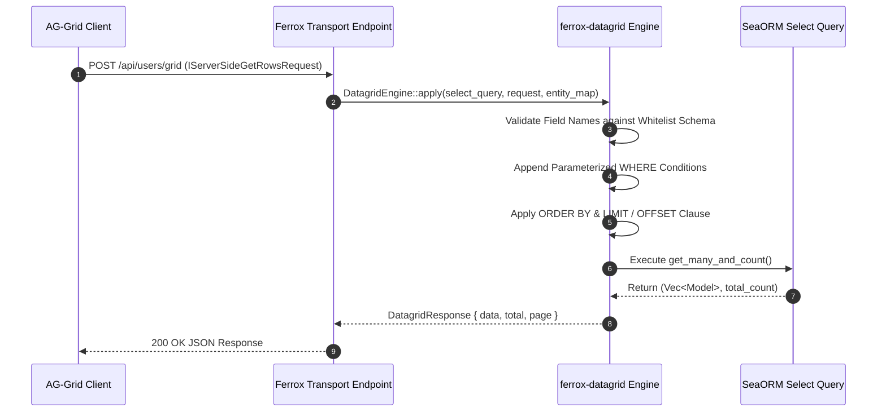

# Server-Side Data Grid Transport & SQL Query Building

The `ferrox-datagrid` crate provides server-side data grid handling for Rust web frameworks. It translates frontend data grid request models (AG-Grid, TanStack Table) into optimized SeaORM / SQL queries with dynamic sorting, filtering, and pagination limits.

---

## 1. What It Is & Architectural Purpose

Web dashboards require fetching tabular datasets with multi-column filtering, flexible column sorting, dynamic text/range searching, and server-side pagination. Writing custom SQL query generators for every data table endpoint causes code duplication and SQL injection vulnerabilities.

`ferrox-datagrid` standardizes server-side data grid processing in Rust. It acts as an abstraction layer between frontend grid models and SeaORM / SQL query builders, guaranteeing type-safe parameter binding and zero SQL injection risks.

```
┌────────────────────────────────────────────────────────────────────────┐
│                        ferrox-datagrid Engine                          │
├────────────────────────────────────────────────────────────────────────┤
│  • Generic Grid Request Parser (AG-Grid / TanStack Table)              │
│  • Whitelisted Column Mapping Validator                                │
│  • SeaORM Select<E> SQL Query Builder                                  │
└──────────────────────────────────┬─────────────────────────────────────┘
                                   │ Parameterized SQL Execution
                                   ▼
┌────────────────────────────────────────────────────────────────────────┐
│                 PostgreSQL / MySQL / SQLite Database                   │
└────────────────────────────────────────────────────────────────────────┘
```

---

## 2. What It Does & Key Capabilities

- **Universal Grid Request Model**: Consumes standard JSON payload specifications containing `page`, `limit`, `sorts`, and `filters`.
- **SeaORM Integration**: Converts filter models directly into SeaORM `Select<Entity>` query conditions.
- **Relational Joined Column Resolution**: Supports filtering and sorting across relational table joins.
- **Strict Column Whitelisting**: Matches incoming field names against explicit column whitelist schemas to block SQL injection.

---

## 3. How It Works Under the Hood

### Datagrid Query Generation Mechanics



---

## 4. Why It Was Designed This Way

| Feature | Raw SQL String Parsing | ferrox-datagrid Engine |
| :--- | :--- | :--- |
| **Security** | Un-sanitized field parameters allow SQL injection. | 100% Parameterized queries with column whitelist enforcement. |
| **Developer Speed**| Writing custom search logic takes days per entity table. | Single service function processes any grid endpoint. |
| **Performance** | Inefficient table scans from missing index joins. | Generates optimized SQL queries tailored to database indexes. |

---

## 5. Practical Usage Guide & Extended Code Examples

### 5.1 Service-Layer Grid Query Processing

```rust
use ferrox_datagrid::{DatagridEngine, DatagridRequest, ColumnMap};
use sea_orm::*;

pub async fn fetch_users_grid(
    db: &DatabaseConnection,
    grid_request: DatagridRequest,
) -> Result<DatagridResult<user::Model>, DbErr> {
    let mut query = user::Entity::find();

    // Map frontend grid field names to SeaORM entity columns
    let column_map = ColumnMap::new()
        .insert("id", user::Column::Id)
        .insert("email", user::Column::Email)
        .insert("status", user::Column::Status)
        .insert("createdAt", user::Column::CreatedAt);

    let datagrid = DatagridEngine::new(query, grid_request, column_map);
    let (data, total) = datagrid.execute(db).await?;

    Ok(DatagridResult {
        data,
        total,
        page: grid_request.page.unwrap_or(1),
        limit: grid_request.limit.unwrap_or(20),
    })
}
```

---

## 6. Anti-Patterns: How NOT to Use It

> [!CAUTION]
> **Anti-Pattern 1: Un-whitelisted Dynamic Column Expressions**
> Never pass client-provided column strings directly to `.order_by_asc()` without validating them against a `ColumnMap` whitelist. Un-sanitized inputs expose database schema details.

---

## 7. Pro-Tips & Best Practices

> [!TIP]
> **Pro-Tip 1: Default Fallback Sorting**
> Always provide a fallback default sort column (e.g., `user::Column::Id DESC`) to ensure deterministic pagination ordering when client sort models are empty.
