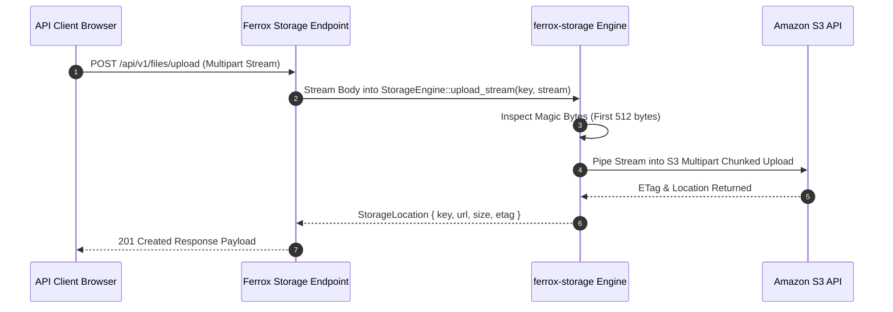

# Cloud File Storage, S3 Streams & Presigned URLs

The `ferrox-storage` crate provides cloud object storage abstractions for Rust applications. It supports zero-buffer multipart streaming uploads, presigned download/upload URL generation, path traversal sanitization, and multi-provider backends (AWS S3, Google Cloud Storage, Azure Blob Storage, and local disk).

---

## 1. What It Is & Architectural Purpose

Enterprise applications require uploading and retrieving large binary assets (documents, images, video feeds, database dumps) without loading entire multi-gigabyte files into server RAM buffers or risking path traversal security exploits.

The `StorageEngine` in Ferrox provides a unified, zero-copy cloud storage API. It abstracts cloud provider SDK complexity while guaranteeing zero-buffer RAM streaming and secure presigned URL generation.

```
┌────────────────────────────────────────────────────────────────────────┐
│                        ferrox-storage Engine                           │
├────────────────────────────────────────────────────────────────────────┤
│  • Path Sanitizer & Key Whitelisting Guard                             │
│  • Zero-Buffer Multipart Stream Manager (Tokio AsyncRead)              │
│  • Presigned URL Generator (S3 / GCS / Azure)                          │
└──────────────────────────────────┬─────────────────────────────────────┘
                                   │ Unified Storage Stream API
            ┌──────────────────────┼──────────────────────┐
            ▼                      ▼                      ▼
┌──────────────────────┐┌──────────────────────┐┌──────────────────────┐
│ Amazon S3 Bucket     ││ Google Cloud Storage ││ Local Filesystem     │
└──────────────────────┘└──────────────────────┘└──────────────────────┘
```

---

## 2. What It Does & Key Capabilities

- **Zero-Buffer Streaming Uploads**: Upload multi-gigabyte files using Tokio `AsyncRead` streams without buffering full files into RAM.
- **Presigned Upload & Download URLs**: Generates temporary cryptographic signed URLs for direct client-to-S3 uploads and downloads.
- **Path Traversal Sanitizer**: Strips `../`, null bytes, and path traversal sequences from target storage keys.
- **Magic Byte Inspection**: Inspects binary magic numbers to verify MIME types (e.g., verifying `.pdf` headers).

---

## 3. How It Works Under the Hood

### Zero-Buffer Upload Stream Pipeline



---

## 4. Why It Was Designed This Way

| Feature | Direct AWS SDK Calls | ferrox-storage Engine |
| :--- | :--- | :--- |
| **RAM Usage** | Loading 1GB file into `Vec<u8>` causes worker pod OOM crashes. | Zero-buffer Tokio `AsyncRead` stream pipe. |
| **Provider Independence**| Code hardcoded to `aws-sdk-s3`. | Single trait works across S3, GCS, Azure, and Local disk. |
| **Security** | Un-sanitized keys expose file overwrite vulnerabilities. | Strict key sanitization & magic byte validation. |

---

## 5. Practical Usage Guide & Extended Code Examples

### 5.1 Uploading Files via Tokio Streams

```rust
use ferrox_storage::{StorageEngine, StorageProvider, UploadRequest};
use tokio::fs::File;

pub async fn upload_customer_document(
    file_path: &str,
    destination_key: &str,
) -> Result<String, StorageError> {
    let storage = StorageEngine::new(StorageProvider::S3 {
        bucket: "company-documents".to_string(),
        region: "us-east-1".to_string(),
    })?;

    let file = File::open(file_path).await?;

    let result = storage.upload_stream(UploadRequest {
        key: format!("documents/{}", destination_key),
        reader: file,
        content_type: "application/pdf".to_string(),
    }).await?;

    Ok(result.url)
}
```

---

## 6. Anti-Patterns: How NOT to Use It

> [!CAUTION]
> **Anti-Pattern 1: Buffering Uploads into `Vec<u8>`**
> Avoid reading full file bodies into memory (`tokio::fs::read()`) before calling storage APIs. Always use streaming readers (`upload_stream`).

---

## 7. Pro-Tips & Best Practices

> [!TIP]
> **Pro-Tip 1: Presigned Browser Direct Uploads**
> Generate presigned upload URLs (`storage.get_presigned_upload_url()`) to allow frontend browsers to upload directly to S3, bypassing backend API servers entirely.
