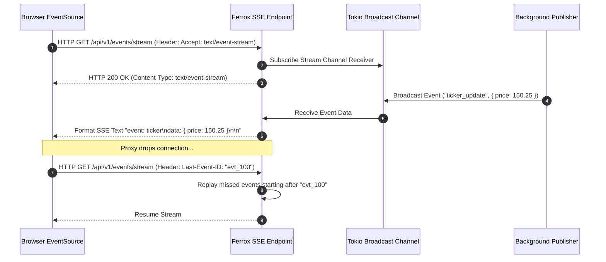

# Server-Sent Events (SSE), Event Streams & Real-Time Broadcasting

The `ferrox-sse` crate provides real-time Server-Sent Events (SSE) streaming for Rust web applications. It features Tokio broadcast channels, client connection heartbeats, event ID reconnect resumes, and low-latency HTTP/2 event streaming.

---

## 1. What It Is & Architectural Purpose

Real-time notification feeds, live financial ticker updates, and streaming AI model responses (LLM text token generation) require unidirectional server-to-client event streaming without the overhead or complexity of full bi-directional WebSockets.

`ferrox-sse` implements native Server-Sent Events (`text/event-stream`). It leverages Tokio channels to broadcast live event streams to thousands of concurrent HTTP clients with zero memory buffer bloat.

```
┌────────────────────────────────────────────────────────────────────────┐
│                          ferrox-sse Engine                             │
├──────────────────────────────────┬─────────────────────────────────────┤
│  Tokio Broadcast Event Stream    │  SSE Protocol Formatter             │
│  • Keep-Alive Heartbeat Timer    │  • id, event, data, retry formatting│
│  • Last-Event-ID Resume Engine   │  • Zero-Copy Bytes Array Buffer     │
└────────────────┬─────────────────┴──────────────────┬──────────────────┘
                 │ HTTP/1.1 & HTTP/2 Event Stream
                 ▼
┌────────────────────────────────────────────────────────────────────────┐
│                        Browser EventSource API                         │
└────────────────────────────────────────────────────────────────────────┘
```

---

## 2. What It Does & Key Capabilities

- **W3C Standard SSE Compliance**: Formats SSE event fields (`id`, `event`, `data`, `retry`, `comment`).
- **`Last-Event-ID` Reconnect Support**: Allows reconnecting clients to resume event streams from their last processed event ID.
- **Automated Keep-Alive Heartbeats**: Sends periodic ping comments (`: heartbeat`) to keep HTTP connections alive through proxies and load balancers.
- **Tokio Channel Broadcaster**: Broadcasts single event emissions to thousands of subscribed client streams simultaneously.

---

## 3. How It Works Under the Hood

### SSE Streaming & Reconnect Mechanics



---

## 4. Why It Was Designed This Way

| Feature | Bi-Directional WebSockets | Server-Sent Events (SSE) |
| :--- | :--- | :--- |
| **Protocol Overhead** | Custom WS handshake, ping/pong frames, framing overhead. | Standard HTTP GET request. Firewall & HTTP/2 friendly. |
| **Reconnection** | Requires custom client JS reconnection logic. | Native browser `EventSource` auto-reconnects out of the box. |
| **Simplicity** | Complex bi-directional protocol handling. | Simple unidirectional server-to-client event stream. |

---

## 5. Practical Usage Guide & Extended Code Examples

### 5.1 Implementing an SSE Endpoint in Rust

```rust
use ferrox_sse::{SseStream, Event};
use futures_util::stream::Stream;
use std::convert::Infallible;

pub async fn stream_stock_prices(
    stock_symbol: String,
) -> SseStream<impl Stream<Item = Result<Event, Infallible>>> {
    let stream = async_stream::stream! {
        let mut count = 0;
        loop {
            tokio::time::sleep(tokio::time::Duration::from_secs(1)).await;
            count += 1;

            let event = Event::default()
                .event("price_update")
                .id(format!("evt_{}", count))
                .data(format!("{{\"symbol\": \"{}\", \"price\": {}}}", stock_symbol, 100 + count));

            yield Ok(event);
        }
    };

    SseStream::new(stream).with_heartbeat(std::time::Duration::from_secs(15))
}
```

---

## 6. Anti-Patterns: How NOT to Use It

> [!CAUTION]
> **Anti-Pattern 1: Buffering Response Bodies**
> Ensure your web server or reverse proxy (Nginx) does not buffer HTTP response bodies (`proxy_buffering off;`). Proxy buffering delays SSE event delivery to clients.

---

## 7. Pro-Tips & Best Practices

> [!TIP]
> **Pro-Tip 1: HTTP/2 Multiplexing**
> Serve SSE endpoints over HTTP/2 or HTTP/3 to bypass the browser's HTTP/1.1 limit of 6 max concurrent connections per domain.
