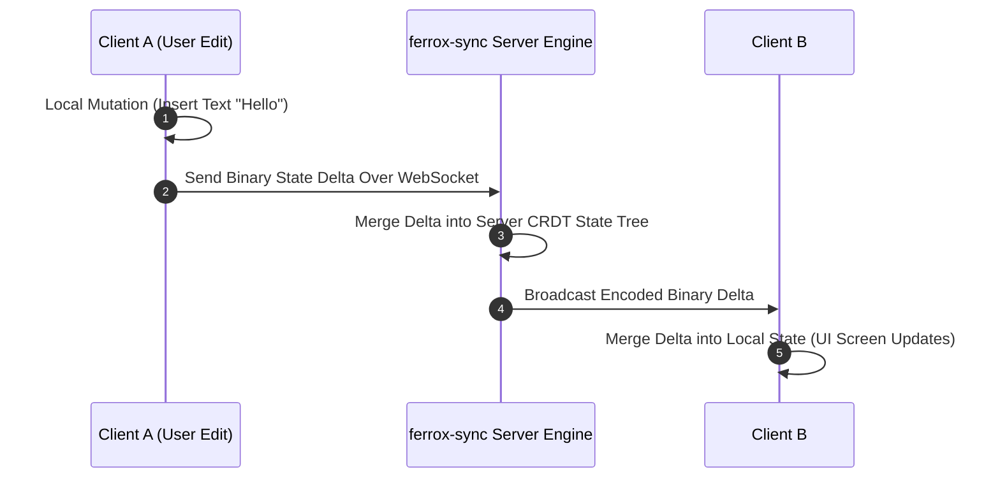

# CRDT Real-Time State Sync Engine & WebSockets

The `ferrox-sync` crate delivers Conflict-Free Replicated Data Type (CRDT) real-time state synchronization over WebSockets for collaborative multi-user applications, live document editing, and distributed state replication in Rust.

---

## 1. What It Is & Architectural Purpose

Multi-user real-time applications (collaborative text editors, multi-user dashboards, live canvas whiteboards) require synchronizing state mutations across multiple connected clients without master-slave lock contention or data loss from concurrent edits.

`ferrox-sync` implements state-based and operation-based CRDT data structures (Yjs / Automerge compatible). It manages WebSocket broadcast delta replication, client state merging, and offline mutation queues in pure Rust.

```
┌────────────────────────────────────────────────────────────────────────┐
│                          ferrox-sync Engine                            │
├──────────────────────────────────┬─────────────────────────────────────┤
│  CRDT State Engine (LWW / Yjs)   │  WebSocket Broadcast Delta Manager  │
│  • Conflict-Free State Merging   │  • Binary Delta Patching            │
│  • Offline Mutation Journal      │  • Multi-Client Session Transport   │
└────────────────┬─────────────────┴──────────────────┬──────────────────┘
                 │ Real-Time WebSocket Deltas
                 ▼                                    ▼
┌─────────────────────────────────┐  ┌──────────────────────────────────┐
│ Client A (WebAssembly)          │  │ Client B (WebAssembly)          │
└─────────────────────────────────┘  └──────────────────────────────────┘
```

---

## 2. What It Does & Key Capabilities

- **Conflict-Free Replication**: Merges concurrent state updates deterministically without central lock arbitration.
- **Binary Delta Streaming**: Encodes state mutation deltas using compact binary byte arrays for low bandwidth usage.
- **Offline Mutation Queueing**: Queues mutations locally when clients lose connectivity and syncs upon reconnection.
- **Multi-Room Transport Broadcaster**: Groups WebSocket clients into channels or document rooms.

---

## 3. How It Works Under the Hood

### CRDT State Delta Replication Sequence



---

## 4. Why It Was Designed This Way

| Feature | Central Lock Re-fetching | ferrox-sync CRDT Engine |
| :--- | :--- | :--- |
| **Concurrency** | Concurrent edits overwrite each other (last-write-wins data loss). | Mathematical CRDT guarantees deterministic convergence across clients. |
| **Latency** | Clients wait for server confirmation before showing edits. | Instant local UI feedback (optimistic UI update). |
| **Offline Safety**| Edits made while offline are rejected upon reconnect. | Offline mutation journal automatically merges upon reconnect. |

---

## 5. Practical Usage Guide & Extended Code Examples

### 5.1 Initializing CRDT Sync Channel

```rust
use ferrox_sync::prelude::*;
use std::sync::Arc;

pub async fn handle_crdt_websocket_session(
    ws_stream: WebSocketStream,
    document_id: String,
    sync_manager: Arc<SyncEngine>,
) {
    let mut session = sync_manager.join_room(&document_id, ws_stream).await;

    while let Some(message) = session.recv().await {
        match message {
            SyncMessage::StateDelta(delta) => {
                // Apply incoming delta and broadcast to room peers
                sync_manager.apply_and_broadcast(&document_id, &delta).await;
            }
            SyncMessage::VectorClockRequest => {
                let current_clock = sync_manager.get_vector_clock(&document_id).await;
                session.send(SyncMessage::VectorClockResponse(current_clock)).await;
            }
        }
    }
}
```

---

## 6. Anti-Patterns: How NOT to Use It

> [!CAUTION]
> **Anti-Pattern 1: Sending Full State Snapshots on Every Mutation**
> Avoid serializing full document state trees on every minor keypress. Always transmit incremental binary delta patches.

---

## 7. Pro-Tips & Best Practices

> [!TIP]
> **Pro-Tip 1: Periodic State Compaction**
> Run periodic CRDT state compaction garbage collection (`sync_engine.compact_room_history(room_id)`) to prune old tombstones and keep delta payloads small.
