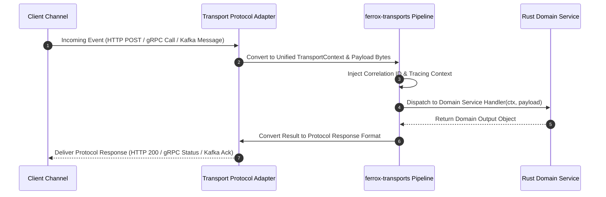

# Multi-Protocol Transports Architecture Overview

The `ferrox-transports` crate delivers a multi-protocol transport engine for Rust applications. It abstracts HTTP/1.1, HTTP/2, WebSockets, gRPC (tonic), Server-Sent Events (SSE), and Apache Kafka messaging into a single transport-agnostic pipeline.

---

## 1. What It Is & Architectural Purpose

Enterprise microservices must serve multiple transport channels simultaneously: RESTful HTTP endpoints for public consumers, GraphQL queries for web frontends, gRPC for low-latency internal RPC calls, WebSockets/SSE for real-time updates, and Kafka for asynchronous message processing.

`ferrox-transports` provides a unified transport engine. It decouples domain handlers from specific protocol drivers, allowing a single domain controller function to serve requests arriving over HTTP, gRPC, or Kafka transparently.

```
                               ┌─────────────────────────────┐
                               │     ferrox-transports       │
                               └──────────────┬──────────────┘
                                              │
           ┌──────────────────────────────────┼──────────────────────────────────┐
           │                                  │                                  │
           ▼                                  ▼                                  ▼
┌─────────────────────┐            ┌─────────────────────┐            ┌─────────────────────┐
│  HTTP / REST Engine │            │  gRPC / Protobuf    │            │  Kafka Messaging    │
│  (Axum / Hyper / SSE)│           │  (Tonic / gRPC v2)  │            │  (rdkafka Consumer) │
└─────────────────────┘            └─────────────────────┘            └─────────────────────┘
```

---

## 2. What It Does & Key Capabilities

- **Protocol Agnostic Context Pipeline**: Standardizes request context (`TransportContext`) across HTTP, gRPC, and Kafka.
- **Axum & Hyper HTTP Transport**: High-speed, non-blocking HTTP/1.1 and HTTP/2 transport engine built on Hyper and Axum.
- **Tonic gRPC Adapter**: High-performance gRPC transport supporting Protobuf serialization and streaming RPCs.
- **Kafka Event Stream Adapter**: Consumes and dispatches Kafka topic messages with partition key hashing and consumer group rebalance hooks.

---

## 3. How It Works Under the Hood

### Multi-Protocol Transport Dispatch Sequence



---

## 4. Why It Was Designed This Way

| Feature | Protocol-Specific Controller Code | Ferrox Multi-Protocol Transports |
| :--- | :--- | :--- |
| **Code Duplication**| Duplicate business logic written for HTTP and gRPC handlers. | Shared domain service logic across HTTP, gRPC, and Kafka. |
| **Performance** | High serialization overhead on protocol conversions. | Zero-copy byte buffer passing between transport layers. |
| **Observability** | Correlation breaks when jumping from HTTP to Kafka. | Automated trace context propagation across all transport channels. |

---

## 5. Practical Usage Guide & Extended Code Examples

### 5.1 Registering Multi-Protocol Transport Engines

```rust
use ferrox_transports::{TransportEngine, HttpTransport, KafkaTransport};

pub async fn bootstrap_transports() -> Result<(), TransportError> {
    let mut engine = TransportEngine::new();

    // Attach HTTP REST Transport Server on port 8080
    engine.add_transport(HttpTransport::new("0.0.0.0:8080"));

    // Attach Kafka Event Consumer Transport
    engine.add_transport(KafkaTransport::new(vec!["localhost:9092"], "order-group"));

    // Start all transport servers concurrently
    engine.listen_all().await?;

    Ok(())
}
```

---

## 6. Anti-Patterns: How NOT to Use It

> [!CAUTION]
> **Anti-Pattern 1: Protocol Coupling in Domain Services**
> Avoid accepting protocol-specific request types (e.g., `axum::extract::Path` or `tonic::Request`) inside core domain services. Keep domain services protocol-agnostic.

---

## 7. Pro-Tips & Best Practices

> [!TIP]
> **Pro-Tip 1: Multiplexing HTTP and gRPC**
> Run HTTP and gRPC transport servers on a single TCP port using gRPC HTTP/2 header multiplexing to simplify Kubernetes container port mappings.
